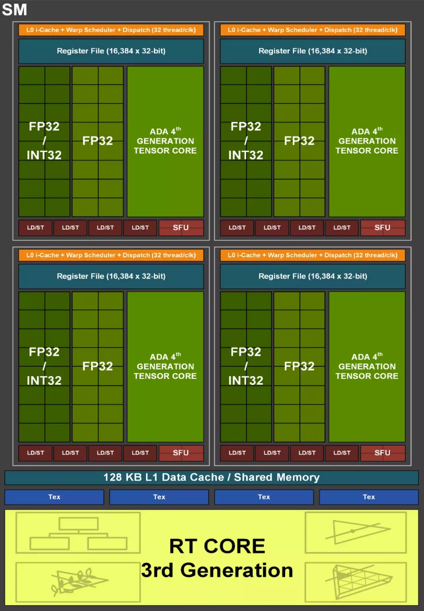

# 1. Архитектура, микроархитектура: отличия, примеры

**Архитектура** и **микроархитектура** — это два уровня проектирования процессоров, которые описывают их функциональные возможности и реализацию, соответственно.

## 1.1. Архитектура процессора

**Архитектура** — это абстрактный уровень описания процессора. Она определяет набор инструкций, регистры, режимы работы, адресное пространство, формат данных и другие аспекты взаимодействия с программным обеспечением. Архитектура — это интерфейс между оборудованием и программным обеспечением.

**Особенности архитектуры:**
- Задаёт `ISA` (Instruction Set Architecture) — набор инструкций, который процессор может выполнять.
- Абстрагируется от конкретных реализаций. Один и тот же набор инструкций может быть реализован разными способами.
- Определяет, как взаимодействовать с памятью и устройствами ввода-вывода.
- Совместимость: программное обеспечение, написанное для одной архитектуры, может работать на любом процессоре с этой архитектурой.

**Примеры архитектур:**
- x86 (Intel, AMD) — используется в ПК и серверах.
- ARM — доминирует в мобильных устройствах и встраиваемых системах.
- RISC-V — открытая архитектура, популярная в образовательных и исследовательских целях.
- MIPS, SPARC, PowerPC — архитектуры с более узкими областями применения.

## 1.2. Микроархитектура процессора

**Микроархитектура** — это конкретная реализация архитектуры. Она описывает физическое устройство процессора, включая логические схемы, технологические процессы и организацию вычислений.

**Особенности микроархитектуры:**
- Определяет, как процессор выполняет инструкции архитектуры на уровне аппаратного обеспечения.
- Может различаться даже у процессоров с одинаковой архитектурой (например, разные микроархитектуры для x86).
- Включает такие аспекты, как:
  - Устройство конвейера (pipeline),
  - Предсказание переходов (branch prediction),
  - Кэширование (L1, L2, L3),
  - Способы выполнения инструкций (out-of-order, superscalar, speculative execution).
- Влияет на производительность, энергопотребление, размер чипа и стоимость производства.

**Примеры микроархитектур:**
- Для архитектуры x86:
  - Intel: Sandy Bridge, Haswell, Ice Lake, Alder Lake.
  - AMD: Zen, Zen 2, Zen 4.
- Для архитектуры ARM:
  - Cortex-A7, Cortex-A55, Cortex-X2.
- Для архитектуры RISC-V:
  - SiFive U74, BOOM.

## 1.3. Отличия и примеры

| **Аспект**        | **Архитектура**                       | **Микроархитектура**                 |
|-------------------|---------------------------------------|--------------------------------------|
| **Уровень**       | Логический, программный интерфейс     | Физический, аппаратная реализация    |
| **Задача**        | Определение возможностей и инструкции | Оптимизация выполнения инструкций    |
| **Совместимость** | Устанавливает стандарты               | Может варьироваться внутри стандарта |
| **Примеры**       | x86, ARM, RISC-V                      | Sandy Bridge, Zen, Cortex-A55        |

**Иллюстрация различий:**
- Программа, написанная для архитектуры `x86`, будет работать на процессорах с микроархитектурами Intel `Skylake` и AMD `Zen 3`. Однако производительность будет различной из-за разной реализации конвейера, кэш-памяти и других аппаратных компонентов.
- Микроархитектура ARM `Cortex-A78` может поддерживать ту же архитектуру ARMv8-A, что и `Cortex-A55`, но первая оптимизирована для высокой производительности, а вторая — для энергоэффективности.

Это разделение позволяет создавать гибкие и масштабируемые решения для различных задач.

# 2. Производительность процессора: понятие “производительность”, способы измерения, единицы измерения

**Производительность процессора** — это характеристика, описывающая его способность выполнять вычислительные задачи за определённое время. Она зависит от архитектуры, микроархитектуры, тактовой частоты, количества ядер, объёма кэш-памяти и других факторов.

## 2.1. Понятие производительности

Производительность процессора измеряет, сколько операций он может выполнить за единицу времени. Она отражает:
- Скорость выполнения инструкций.
- Эффективность параллельной обработки.
- Взаимодействие с памятью и периферийными устройствами.

**Зависимость производительности:**
- Тактовая частота (GHz): количество тактов за секунду.
- IPC (Instructions Per Clock): количество инструкций, выполняемых за один такт.
- Число ядер и потоков: чем больше ядер, тем выше теоретическая возможность параллельной обработки.
- Кэш-память: уменьшает время обращения к данным.
- Архитектурные особенности: предсказание переходов, конвейеризация, SIMD.

## 2.2. Способы измерения производительности

- **Синтетические тесты**:
   - Используются специализированные бенчмарки.
   - Примеры:
     - Cinebench: измеряет производительность в рендеринге.
     - Geekbench: общий тест производительности для CPU.
     - SPEC CPU: анализирует вычислительную нагрузку.

- **Реальные сценарии использования**:
   - Измерение времени выполнения задач в приложениях, таких как:
     - Компиляция программ.
     - Рендеринг видео.
     - Игра в ресурсоёмкие игры.

- **Пропускная способность**:
   - Измеряется количество операций с памятью или данными за единицу времени.
   - Пример: GB/s (гигабайты в секунду) при работе с памятью.

- **Энергетическая эффективность**:
   - Измеряет производительность на единицу потребляемой энергии.
   - Пример: GFlops/W (гигафлопс на ватт).

## 2.3. Единицы измерения производительности

- **Тактовая частота**:
   - Измеряется в `Герцах (Hz)`: количество тактов за секунду.
   - 1 GHz = 10⁹ тактов в секунду.

- **Количество операций**:
   - `MIPS` (Million Instructions Per Second): миллионы инструкций в секунду.
   - `FLOPS` (Floating Point Operations Per Second): операции с плавающей запятой.
     - `GFLOPS` (гигафлопс): 10⁹ операций в секунду.
     - `TFLOPS` (терафлопс): 10¹² операций в секунду.

- **Время выполнения задач**:
   - Измеряется в секундах или миллисекундах.

- **Пропускная способность**:
   - `Гигабайты в секунду (GB/s)`: скорость работы с памятью или дисковыми устройствами.

# 3. Классификация архитектур (CISC, RISC, VLIW, EPIC)

## 3.1. Основные типы архитектур

**Регистровая архитектура**
- Описание: Характеризуется свободным доступом к регистрам для выборки всех аргументов и записи результата.
- Особенности:
  - Элементарные арифметико-логические операции кодируются в двух- или трёхоперандные инструкции:
  - Пример: `регистр + регистр → регистр`.
  - Регистр результата иногда совпадает с источником одного из аргументов.
- Применение: Преимущественно используется в современных процессорах, где высокая производительность достигается за счёт быстрого доступа к регистрам.

**Аккумуляторная архитектура**
- Описание: Из регистров выделяется один или несколько регистров-аккумуляторов, которые являются:
  - Источником одного из аргументов.
  - Приёмником результата вычислений.
- Особенности:
  - Операции кодируются, как правило, в однооперандные инструкции:
    - Пример: `аккумулятор + операнд → аккумулятор`.
  - Простая организация набора инструкций.
- Пример: Архитектура характерна для многих CISC-процессоров (например, Z80).

**Стековая архитектура**
- Описание: Организация регистрового файла в виде стека, где регистры адресуются косвенно через указатель стека.
- Особенности:
  - Указатель стека определяет положение вершины стека.
  - Операции выполняются над значениями на вершине стека.
  - Результат помещается обратно на вершину.
  - Арифметические операции кодируются в нуль-операндные инструкции.
- Применение: Основной тип архитектуры для MISC-процессоров.

## 3.2. Классификация регистровых архитектур по количеству операндов, которые могут быть загружены в АЛУ напрямую

**Регистр – регистр (0)**
  - Все операнды загружаются и сохраняются в регистрах.
  - Быстрая работа за счёт исключения прямого обращения к памяти.

**Регистр – память (1)**
  - Один операнд загружается из регистра, другой — из памяти.
  - Баланс между производительностью и гибкостью.

**Память – память (2+)**
  - Оба операнда и результаты могут находиться в памяти.
  - Наименее производительный способ, но позволяет минимизировать использование регистров.

## 3.3. Классификация CISC, RISC, VLIW, EPIC

### 3.3.1. CISC (Complex Instruction Set Computing)

**CISC** — архитектура с комплексным набором инструкций, предназначенная для выполнения сложных операций за одну команду.

**Характеристики:**
- Инструкции имеют **различную длину**.
- Одна команда может выполнять сложную задачу (например, загрузка из памяти, вычисление, сохранение).
- Меньший размер программ за счёт использования сложных команд.
- Требует сложных декодеров и исполнительных блоков, что увеличивает сложность реализации.

**Преимущества:**
- Упрощает разработку программ, так как инструкции более выразительны.
- Эффективно использует память, так как меньше команд нужно для выполнения задачи.

**Недостатки:**
- Уменьшенная производительность из-за сложного декодирования инструкций.
- Сложная реализация на аппаратном уровне.

**Примеры:**
- x86 (Intel, AMD).
- IBM System/360.

### 3.3.2. RISC (Reduced Instruction Set Computing)

**RISC** — архитектура с упрощённым набором инструкций, каждая из которых выполняется за один такт.

**Характеристики:**
- Инструкции имеют фиксированную длину.
- Простой и ограниченный набор команд.
- Большая зависимость от оптимизации программного обеспечения (компиляторов).
- Выполнение инструкций чаще всего осуществляется с использованием регистров.

**Преимущества:**
- Высокая производительность за счёт конвейеризации.
- Простота реализации в аппаратуре.
- Лёгкость масштабирования и модернизации.

**Недостатки:**
- Больший размер программ из-за необходимости использования нескольких простых команд.
- Меньшая совместимость с уже существующим ПО.

**Примеры:**
- ARM (используется в мобильных устройствах и встраиваемых системах).
- MIPS, SPARC.
- RISC-V — открытая архитектура.

### 3.3.3. VLIW (Very Long Instruction Word)

**VLIW** — архитектура, которая использует длинные слова инструкций, содержащие несколько операций для выполнения параллельно.

**Характеристики:**
- Каждое длинное слово состоит из нескольких инструкций, которые могут выполняться одновременно.
- Параллелизм обеспечивается на уровне компиляции (компилятор распределяет задачи по вычислительным модулям).
- Отсутствие сложных блоков предсказания переходов или управления зависимостями.

**Преимущества:**
- Высокая производительность для задач, где есть явный параллелизм.
- Простота реализации процессора (нет необходимости в сложной аппаратной логике).

**Недостатки:**
- Зависимость от компилятора, который должен эффективно распределять инструкции.
- Большой объём памяти, так как длинные слова увеличивают размер программ.
- Проблемы с энергопотреблением.

**Примеры:**
- Itanium от Intel (также использует принципы EPIC).
- DSP-процессоры (цифровая обработка сигналов).

### 3.3.4. EPIC (Explicitly Parallel Instruction Computing)

**EPIC** — архитектура, основанная на идеях VLIW, но с акцентом на явное управление параллелизмом.

**Характеристики:**
- Параллельные инструкции упаковываются в группы, определяемые компилятором.
- Поддержка аппаратных предсказаний переходов и динамического выполнения.
- Большое количество регистров для обработки данных.

**Преимущества:**
- Высокая производительность за счёт масштабируемого параллелизма.
- Подходит для вычислительных систем, требующих высокой мощности.

**Недостатки:**
- Сложность разработки компиляторов.
- Ограниченная совместимость с традиционными программами.

**Примеры:**
- Intel Itanium (платформа IA-64).
- Платформы для специализированных суперкомпьютеров.

## 3.4. **Сравнение архитектур**

| **Характеристика**             | **CISC**               | **RISC**              | **VLIW**                          | **EPIC**                            |
|--------------------------------|------------------------|-----------------------|-----------------------------------|-------------------------------------|
| **Принцип работы**             | Комплексные инструкции | Упрощённые инструкции | Параллелизм на уровне компилятора | Параллелизм с аппаратной поддержкой |
| **Длина инструкции**           | Переменная             | Фиксированная         | Длинные слова                     | Длинные слова                       |
| **Зависимость от компилятора** | Низкая                 | Средняя               | Высокая                           | Высокая                             |
| **Аппаратная сложность**       | Высокая                | Низкая                | Низкая                            | Средняя                             |
| **Примеры**                    | x86, IBM 360           | ARM, RISC-V           | Itanium, DSP                      | Itanium, суперкомпьютеры            |

# 4. Классификация архитектур (x86, x86-64, Power, ARM, IA64, RISC-V, MIPS, Alpha)

**x86**
- Тип: CISC.
- Описание: Архитектура с комплексным набором инструкций, широко используемая в ПК и серверах.
- Характеристики:
  - Переменная длина инструкций.
  - Широкий набор сложных инструкций, включая операции с памятью.
  - Совместимость с программами для устаревших платформ.
- Преимущества:
  - Большая экосистема программного обеспечения.
  - Подходит для универсального использования.
- Недостатки:
  - Сложность аппаратной реализации.
  - Меньшая энергоэффективность по сравнению с ARM.
- Примеры: Intel Pentium, AMD Athlon.

**x86-64**
- Тип: CISC.
- Описание: Расширение x86 для 64-битных вычислений, позволяющее использовать больше оперативной памяти и дополнительные регистры.
- Характеристики:
  - Совместимость с 32-битными приложениями.
  - Поддержка больших объёмов памяти (до 16 эксабайт).
  - Оптимизация для многопоточных задач.
- Преимущества:
  - Высокая производительность для серверов и рабочих станций.
  - Увеличение возможностей современных ОС.
- Недостатки:
  - Больший размер исполняемых файлов.
- Примеры: Intel Core i7, AMD Ryzen.

**Power (PowerPC, POWER ISA)**
- Тип: RISC.
- Описание: Архитектура от IBM, использующая упрощённый набор инструкций для высокой производительности.
- Характеристики:
  - Хорошо масштабируется для суперкомпьютеров.
  - Высокая производительность для параллельных задач.
- Преимущества:
  - Высокая скорость вычислений.
  - Поддержка больших вычислительных кластеров.
- Недостатки:
  - Ограниченное использование в потребительских устройствах.
- Примеры: IBM POWER9, POWER10.

**ARM**
- Тип: RISC.
- Описание: Архитектура с упрощённым набором инструкций, оптимизированная для мобильных и встроенных систем.
- Характеристики:
  - Низкое энергопотребление.
  - Широкая поддержка SIMD для мультимедийных задач.
  - Подходит для встраиваемых систем и IoT.
- Преимущества:
  - Высокая энергоэффективность.
  - Большая популярность в мобильной индустрии.
- Недостатки:
  - Меньшая производительность в задачах с высокой нагрузкой.
- Примеры: Apple A-series, Qualcomm Snapdragon.

**IA-64 (Itanium)**
- Тип: EPIC.
- Описание: Архитектура от Intel с явным параллелизмом, разработанная для высокопроизводительных серверов.
- Характеристики:
  - Использует длинные инструкции для выполнения нескольких операций.
  - Полная зависимость от оптимизации компилятора.
- Преимущества:
  - Высокая производительность при параллельных вычислениях.
  - Подходит для корпоративных серверов.
- Недостатки:
  - Ограниченная совместимость с другими платформами.
  - Не получила массового распространения.
- Примеры: Intel Itanium.

**RISC-V**
- Тип: RISC.
- Описание: Открытая архитектура для разработки кастомных процессоров с модульной структурой.
- Характеристики:
  - Набор инструкций минимален, можно добавлять расширения.
  - Используется как встраиваемых системах, так и в суперкомпьютерах.
- Преимущества:
  - Простота реализации.
  - Возможность кастомизации.
- Недостатки:
  - Меньшая экосистема программного обеспечения.
- Примеры: SiFive Freedom.

**MIPS**
- Тип: RISC.
- Описание: Архитектура с упрощённым набором инструкций, популярная в образовательных и встраиваемых системах.
- Характеристики:
  - Простая реализация и энергопотребление.
  - Поддержка SIMD и мультипоточности.
- Преимущества:
  - Лёгкость изучения.
  - Использование в сетевом оборудовании.
- Недостатки:
  - Устаревание по сравнению с ARM.
- Примеры: MIPS R4000, I6400.

**Alpha**
- Тип: RISC.
- Описание: Архитектура для высокопроизводительных серверов, разработанная DEC.
- Характеристики:
  - 64-битные регистры.
  - Высокая скорость вычислений.
- Преимущества:
  - Высокая производительность.
  - Подходит для научных и инженерных задач.
- Недостатки:
  - Прекращено развитие.
- Примеры: Alpha 21064, 21364.

**SPARC**
- Тип: RISC.
- Описание: Архитектура для серверов и суперкомпьютеров, разработанная Sun Microsystems.
- Характеристики:
  - Высокая масштабируемость.
  - Многопоточность и высокая надёжность.
- Преимущества:
  - Эффективна для серверных задач.
  - Используется в высоконагруженных системах.
- Недостатки:
  - Ограниченная экосистема.
- Примеры: UltraSPARC, SPARC64.

**Z (System Z)**
- Тип: CISC.
- Описание: Архитектура IBM для мейнфреймов, оптимизированная для надёжности и многопользовательских задач.
- Характеристики:
  - Поддержка больших объёмов памяти.
  - Высокая надёжность и производительность.
- Преимущества:
  - Идеальна для корпоративных систем.
  - Поддержка современных технологий виртуализации.
- Недостатки:
  - Высокая стоимость.
- Примеры: IBM z15.

# 5. Кодирование инструкций на примере MIPS и х86

## 5.1. **Кодирование инструкций в MIPS**

MIPS является архитектурой с фиксированной длиной инструкций. Каждая инструкция занимает ровно 32 бита и имеет строгую структуру.

**Форматы инструкций MIPS**:
- **R-формат (регистр-регистр)**:
  - Используется для арифметических и логических операций.
  - Структура:
    ```
    | opcode (6 бит) | rs (5 бит) | rt (5 бит) | rd (5 бит) | shamt (5 бит) | funct (6 бит) |
    ```
    - **opcode**: код операции (например, 0 для арифметических операций).
    - **rs**: регистр-источник 1.
    - **rt**: регистр-источник 2.
    - **rd**: регистр-назначение.
    - **shamt**: сдвиг (для операций сдвига).
    - **funct**: дополнительный код операции.

  - Пример: 
    ```
    сложение (add $t1, $t2, $t3)
    ```
    - opcode: `000000` (арифметическая операция),
    - rs: `01010` ($t2),
    - rt: `01011` ($t3),
    - rd: `01001` ($t1),
    - shamt: `00000` (нет сдвига),
    - funct: `100000` (код для сложения).
    - Итог: `000000 01010 01011 01001 00000 100000`.

- **I-формат (регистр-память)**:
   - Используется для операций с памятью и непосредственными значениями.
   - Структура:
     ```
     | opcode (6 бит) | rs (5 бит) | rt (5 бит) | immediate (16 бит) |
     ```
     - **opcode**: код операции.
     - **rs**: регистр-источник.
     - **rt**: регистр-назначение.
     - **immediate**: непосредственное значение или смещение.

  - Пример: 
    ```
    загрузка (lw $t1, 4($t2))
    ```
    - opcode: `100011` (код для lw),
    - rs: `01010` ($t2),
    - rt: `01001` ($t1),
    - immediate: `0000 0000 0000 0100` (4 в 16-битной форме).
    - Итог: `100011 01010 01001 0000 0000 0000 0100`.

- **J-формат (прыжки)**:
  - Используется для инструкций перехода.
  - Структура:
    ```
    | opcode (6 бит) | address (26 бит) |
    ```
    - **opcode**: код операции.
    - **address**: адрес для перехода.

  - Пример: 
    ```
    переход (j 0x00400000)
    ```
    - opcode: `000010` (код для j),
    - address: `0000 0000 0001 0000 0000 0000`.
    - Итоговая инструкция: `000010 0000 0000 0001 0000 0000 0000`.

## 5.2. Кодирование инструкций в x86

Архитектура x86 использует инструкции переменной длины (от 1 до 15 байт). Кодирование инструкций более сложное и включает несколько компонентов.

**Формат инструкции x86**:
- **Префиксы** (опционально):
  - Используются для модификации поведения инструкции (например, адресация, работа с сегментами).
  - Длина: 1-4 байта.

- **Код операции (Opcode)**:
  - Основная часть инструкции, указывающая тип операции.
  - Длина: 1-3 байта.

- **ModR/M байт** (опционально):
  - Определяет регистры и/или модификаторы адресации.
  - Структура (8 бит):
    ```
    | mod (2 бита) | reg/opcode (3 бита) | r/m (3 бита) |
    ```

- **SIB байт** (опционально):
  - Используется для сложной адресации (индекс, базовый регистр, масштаб).
  - Структура (8 бит):
    ```
    | scale (2 бита) | index (3 бита) | base (3 бита) |
    ```

- **Непосредственное значение (Immediate)**:
  - Может содержать операнды или адреса.
  - Длина: 1-4 байта.

**Пример**: 
```
сложение (add eax, ebx)
```
- Префиксы: отсутствуют.
- Opcode: `03` (add с использованием ModR/M).
- ModR/M: `C3` (mod = `11` (оба операнда - регистры), reg = `000` (eax), r/m = `011` (ebx)).
- Итог: `03 C3`.

# 6. Типы инструкций. Примеры

Процессорные инструкции делятся на типы в зависимости от выполняемых операций. Каждый тип обеспечивает выполнение определённых задач в процессе работы процессора.

**Арифметические инструкции**
- Выполняют математические операции, такие как сложение, вычитание, умножение, деление.
- Примеры:
  - Сложение чисел: `ADD R1, R2, R3` (RISC) или `ADD AX, BX` (CISC).
  - Вычитание чисел: `SUB R1, R2, R3` или `SUB AX, BX`.

**Логические инструкции**
- Выполняют побитовые операции, такие как AND, OR, XOR, NOT.
- Примеры:
  - Побитовое И: `AND R1, R2, R3`.
  - Побитовое ИЛИ: `OR R1, R2, R3`.
  - Побитовое исключающее ИЛИ: `XOR AX, BX`.

**Инструкции передачи данных**
- Перемещают данные между регистрами, памятью и другими устройствами.
- Примеры:
  - Загрузка из памяти: `LOAD R1, [100]`.
  - Сохранение в память: `STORE [100], R1`.
  - Перемещение между регистрами: `MOV AX, BX`.

**Инструкции управления потоком**
- Определяют порядок выполнения инструкций, включая переходы и вызовы функций.
- Примеры:
  - Безусловный переход: `JMP label`.
  - Условный переход: `BEQ R1, R2, label` (если R1 == R2).
  - Вызов функции: `CALL label`.

**Инструкции сдвига и вращения**
- Изменяют положение битов в регистре.
- Примеры:
  - Логический сдвиг влево: `SHL R1, 1`.
  - Логический сдвиг вправо: `SHR R1, 1`.
  - Вращение вправо: `ROR R1, 1`.

**Инструкции сравнения**
- Выполняют операции сравнения двух значений.
- Примеры:
  - Сравнение чисел: `CMP R1, R2` (CISC) или `SLT R1, R2, R3` (RISC, меньшее значение).

**Системные инструкции**
- Управляют состоянием процессора и выполняют привилегированные операции.
- Примеры:
  - Системный вызов: `SYSCALL` (MIPS), `INT 0x80` (x86).
  - Остановка процессора: `HLT`.

**Векторные и мультимедийные инструкции**
- Обрабатывают массивы данных или мультимедийные потоки.
- Примеры:
  - Векторное сложение: `ADDPS xmm1, xmm2` (SSE).
  - Умножение чисел с плавающей точкой: `MULPD xmm1, xmm2`.

**Инструкции работы с памятью**
- Управляют доступом к памяти (например, управление кэшами).
- Примеры:
  - Инвалидирование кэша: `INVLPG` (x86).
  - Загрузка строки из памяти: `LDS` (x86).

**Инструкции работы с числами с плавающей точкой**
- Выполняют операции над числами с плавающей точкой.
- Примеры:
  - Сложение: `FADD` (x86 FPU).
  - Деление: `FDIV`.

# 7. Арифметические инструкции. Инструкции вещественного сопроцессора

Арифметические инструкции предназначены для выполнения базовых математических операций, таких как сложение, вычитание, умножение и деление. Они поддерживают как целочисленные, так и вещественные вычисления (работа с числами с плавающей точкой).

## 7.1. Арифметические инструкции

Эти инструкции выполняются основным процессором и работают с целочисленными данными.

**Типы операций:**
- **Сложение**: Добавляет два числа.
- **Вычитание**: Вычитает одно число из другого.
- **Умножение**: Перемножает два числа.
- **Деление**: Делит одно число на другое.
- **Инкремент и декремент**: Увеличивает или уменьшает значение на единицу.

**Примеры:**
- **MIPS**:
  - `add $t1, $t2, $t3` — сложение значений из `$t2` и `$t3`, результат в `$t1`.
  - `sub $t1, $t2, $t3` — вычитание `$t3` из `$t2`, результат в `$t1`.
  - `mul $t1, $t2, $t3` — умножение значений `$t2` и `$t3`.
- **x86**:
  - `ADD eax, ebx` — сложение `eax` и `ebx`, результат в `eax`.
  - `SUB eax, 4` — вычитание 4 из значения регистра `eax`.
  - `IMUL eax, ebx` — умножение содержимого `eax` и `ebx`.

## 7.2. Инструкции вещественного сопроцессора

Процессоры с поддержкой чисел с плавающей точкой (например, x86 FPU или инструкции SSE/AVX) используют специализированные инструкции для работы с вещественными данными.

**Типы операций:**
- **Сложение с плавающей точкой**: Выполняет операцию сложения чисел с плавающей точкой.
- **Вычитание с плавающей точкой**: Аналогично вычитанию, но для вещественных чисел.
- **Умножение с плавающей точкой**: Перемножает вещественные числа.
- **Деление с плавающей точкой**: Делит одно вещественное число на другое.
- **Корень из числа**: Вычисляет квадратный корень.
- **Преобразования типов**: Преобразует целые числа в вещественные и наоборот.

**Примеры:**
- **x86 FPU (инструкции сопроцессора x87)**:
  - `FADD` — сложение вещественных чисел.
  - `FSUB` — вычитание вещественных чисел.
  - `FMUL` — умножение вещественных чисел.
  - `FDIV` — деление вещественных чисел.
  - `FSQRT` — вычисление квадратного корня.
- **SSE/AVX (x86)**:
  - `ADDPS xmm1, xmm2` — сложение пакета вещественных чисел одинарной точности.
  - `MULPD xmm1, xmm2` — умножение пакета чисел двойной точности.
  - `DIVPS xmm1, xmm2` — деление пакета чисел.
- **MIPS (Coprocessor 1 - FPU)**:
  - `add.s $f1, $f2, $f3` — сложение чисел с плавающей точкой одинарной точности.
  - `sub.d $f1, $f2, $f3` — вычитание чисел с плавающей точкой двойной точности.
  - `mul.s $f1, $f2, $f3` — умножение чисел с плавающей точкой одинарной точности.
  - `div.d $f1, $f2, $f3` — деление чисел с плавающей точкой двойной точности.

# 8. Регистровый файл. Разновидности регистрового файла

Регистровые файлы могут быть организованы по-разному в зависимости от архитектуры процессора и его требований. Рассмотрим несколько типов регистровых файлов:

## 8.1. Классический регистровый файл

Классический регистровый файл представляет собой набор регистров общего назначения, каждый из которых может быть использован для хранения данных или промежуточных результатов вычислений. Эти регистры имеют одинаковую разрядность и используются для любых операций.

**Примеры:**
- **MIPS**: Процессор использует набор из 32 регистров общего назначения, которые могут быть использованы для хранения данных или выполнения операций.
- **x86**: В архитектуре x86 регистры общего назначения, такие как `AX`, `BX`, `CX`, `DX`, являются примером классического регистрового файла.

**Преимущества:**
- Простота реализации.
- Универсальность, поскольку любой регистр может быть использован для любой операции.

**Недостатки:**
- Отсутствие специализации для различных типов данных, таких как числа с плавающей точкой или векторные данные.

## 8.2. Стековый регистровый файл

Стековый регистровый файл организует регистры как стек, где данные добавляются и извлекаются по принципу LIFO (Last In, First Out). Это позволяет эффективно управлять подпрограммами и операциями возврата.

**Примеры:**
- **x86**: В x86 процессорах стековые операции выполняются с помощью регистров, таких как `ESP` (указатель стека).
- **MIPS**: В MIPS регистровый стек используется для управления стеком данных при вызове подпрограмм.

**Преимущества:**
- Эффективность при выполнении операций с функциями и возвращением значений.
- Простота реализации в системах с ограниченными ресурсами.

**Недостатки:**
- Ограниченная гибкость для выполнения сложных вычислений, требующих произвольного доступа к регистрам.

## 8.3. Регистровый файл с изменяемой разрядностью

В регистровом файле с изменяемой разрядностью регистры могут изменять свою разрядность в зависимости от потребностей программы. Это позволяет использовать меньшие регистры для простых операций и большие для более сложных вычислений.

**Пример:**
- **ARM**: В архитектуре ARM используется гибкость разрядности, позволяя использовать различные ширины данных для разных операций.

**Преимущества:**
- Оптимизация использования регистров в зависимости от задачи.
- Уменьшение потребления памяти и повышение производительности за счёт использования меньших регистров для простых операций.

**Недостатки:**
- Усложнение архитектуры и обработки команд.

## 8.4. Статический оконный регистровый файл

В статическом оконном регистровом файле набор регистров делится на несколько окон, каждое из которых используется для выполнения операций в определённой области программы. При переходе между окнами происходит переключение на новое окно регистров.

**Пример:**
- **SPARC**: Архитектура SPARC использует статическое оконное разделение регистров, где каждый набор регистров является независимым "окном", используемым при выполнении различных функций.

**Преимущества:**
- Позволяет избежать конфликтов между вызовами функций, обеспечивая быстрый доступ к данным, используемым в подпрограммах.
- Уменьшает количество операций сохранения и восстановления данных в стеке.

**Недостатки:**
- Необходимость управления окнами и сложность реализации.

## 8.5. Динамический оконный (регистровый стек) файл

В динамическом оконном регистровом файле используется принцип "окна", однако размер и количество окон могут изменяться в зависимости от текущих потребностей программы. Это динамическое распределение регистров позволяет оптимально использовать ресурсы, эффективно управляя контекстом выполнения программы.

**Пример:**
- **VAX**: В процессоре VAX используется динамическое оконное распределение регистров для оптимального выполнения вычислений в многозадачных системах.

**Преимущества:**
- Гибкость в управлении регистрами в зависимости от текущих потребностей программы.
- Повышение производительности за счёт эффективного использования регистров.

**Недостатки:**
- Высокая сложность управления окнами и переключения между ними.
- Требует дополнительных вычислительных ресурсов для управления регистровым стеком.

# 9. Организация памяти. Устройство управления памятью (MMU)

**Организация памяти** в компьютере — это способ, с помощью которого данные и инструкции размещаются и извлекаются из различных уровней памяти в системе. Ключевую роль в управлении памятью выполняет **устройство управления памятью (MMU)**, которое отвечает за трансляцию адресов, защиту данных, управление кэшированием и виртуализацией памяти.

## 9.1. Организация памяти

Организация памяти включает несколько уровней хранения данных, от быстрых, но ограниченных в объеме регистров и кэшей до более медленных, но объемных внешних устройств хранения (например, жестких дисков). Существует несколько видов памяти:
- **Регистр (CPU Registers)** - наименьший и самый быстрый тип памяти, которая непосредственно доступна процессору. Регистр используется для хранения промежуточных данных, операндов, адресов и флагов. Количество регистров ограничено и обычно составляет несколько десятков.
- **Кэш-память (Cache Memory)** - используется для хранения наиболее часто используемых данных и инструкций, с целью ускорения доступа к ним. Кэш-память обычно разделяется на несколько уровней:
  - **L1 кэш**: Находится непосредственно в процессоре, имеет самый быстрый доступ.
  - **L2 кэш**: Может быть встроен в процессор или находиться рядом с ним. Чуть медленнее, чем L1.
  - **L3 кэш**: Общий кэш для нескольких ядер процессора, более медленный, чем L2.
- **Оперативная память (RAM)** - основная память, используемая для хранения данных и программ во время выполнения. В оперативной памяти данные могут быть быстро изменены. Оперативная память разделяется на два типа:
  - **Статическая RAM (SRAM)**: Быстрее и дороже, используется для кэш-памяти.
  - **Динамическая RAM (DRAM)**: Более медленная, используется в качестве основной памяти.
- **Виртуальная память** - позволяет операционной системе использовать жесткий диск или другие устройства хранения данных как дополнение к физической памяти.

## 9.2. Устройство управления памятью (MMU)

**MMU (Memory Management Unit)** — это аппаратный компонент, который управляет доступом к памяти и предоставляет функции виртуализации памяти. 

**Основные задачи MMU включают:**
- **Трансляция адресов (Address Translation)**: процессор работает с виртуальными адресами, но для доступа к памяти эти адреса должны быть преобразованы в физические. MMU выполняет трансляцию виртуальных адресов в физические с помощью таблиц страниц.
- **Управление кэшированием (Cache Management)**: MMU также может управлять кэшированием, например, кэшировать данные из основной памяти для повышения производительности. Это позволяет ускорить доступ к часто используемым данным.
- **Защита памяти (Memory Protection)**: MMU обеспечивает защиту памяти, чтобы одна программа не могла случайно или намеренно изменить данные другой программы. Для этого она использует различные механизмы, такие как разрешения на доступ (чтение, запись, исполнение).
- **Виртуализация памяти (Virtual Memory Management)**: MMU поддерживает виртуальную память, что позволяет операционной системе создавать большие адресные пространства, чем физическая память, посредством механизма страницы и свопинга.

## 9.A. Механизм работы MMU

MMU работает с таблицами страниц, которые содержат информацию о том, какие виртуальные страницы соответствуют каким физическим адресам. Процесс работы включает несколько этапов:
1. **Виртуальный адрес**: Когда процессор пытается обратиться к определенному адресу, этот адрес является виртуальным. Виртуальные адреса должны быть переведены в физические для работы с памятью.
2. **Трансляция через таблицы страниц**: Таблицы страниц, хранящиеся в памяти, содержат информацию о маппинге виртуальных страниц в физические. MMU использует эти таблицы для перевода виртуальных адресов в физические.
3.  **Преобразование адреса**: MMU использует разделение виртуального адреса на две части:
  - **Номер страницы**: указывает на определённую страницу в виртуальной памяти.
  - **Смещение в странице**: указывает на конкретное местоположение данных внутри страницы.
4. **Кэширование и защита**: MMU может также кешировать переведённые адреса в специальных кэшах, таких как **TLB (Translation Lookaside Buffer)**, для ускорения повторных трансляций.

## 9.B. Структура таблиц страниц

Таблицы страниц могут быть организованы по-разному, в зависимости от архитектуры процессора. Например:
- **Одноступенчатая таблица**: используется в более простых системах, где один уровень таблицы отвечает за преобразование виртуальных адресов в физические.
- **Многоступенчатая таблица**: используется в более сложных системах, где виртуальный адрес делится на несколько частей. Каждая часть указывает на очередной уровень таблицы, пока не будет найден конечный физический адрес.

# 10. Виртуальная память. TLB

## 10.1. Виртуальная память

**Виртуальная память** — это концепция управления памятью, которая позволяет операционной системе (ОС) предоставить процессам иллюзию, что они имеют доступ к большему объему памяти, чем физически доступно в системе. Виртуальная память использует механизмы **страничной адресации** и **свопинга** для обеспечения этого эффекта.

**Основные принципы виртуальной памяти**
- **Адресация**: Виртуальная память использует виртуальные адреса, которые затем преобразуются в физические с помощью устройства управления памятью (MMU). Это позволяет процессам работать с адресами, которые не существуют в реальной физической памяти, а находятся на жестком диске.  
- **Таблицы страниц**: Виртуальная память основана на использовании таблиц страниц для преобразования виртуальных адресов в физические. Каждая страница виртуальной памяти соответствует определенному куску физической памяти (или даже жесткому диску).
- **Свопинг (Swapping)**: Когда физическая память переполнена, операционная система может выгрузить данные, неактивные в данный момент, на диск, освобождая место для более активных данных. Это называется свопингом.
- **Разбиение памяти**: Все физическое адресное пространство процесса разбито на виртуальные страницы. Вся физическая память также разбита на физические страницы того же размера. Это позволяет процессам работать с адресами, не привязанными к физическому расположению данных в памяти.
- **Файл подкачки**: Помимо оперативной памяти, страницы могут быть размещены в файле подкачки (swap file), который хранится на жестком диске, если физическая память полностью занята. Это расширяет доступное пространство, но значительно замедляет доступ к данным.

## 10.2. TLB (Translation Lookaside Buffer)

**TLB (Translation Lookaside Buffer)** — это кэш, используемый для хранения недавно использованных преобразованных виртуальных адресов в физические. TLB ускоряет процесс преобразования виртуальных адресов в физические, поскольку обращение к этому кэшу гораздо быстрее, чем обращение к основным таблицам страниц в памяти.

**Основные принципы работы TLB**:
- **Кэширование преобразованных адресов**: Когда процессор обращается к виртуальной памяти, MMU выполняет преобразование виртуального адреса в физический с помощью таблиц страниц. Для ускорения работы этого процесса используется **TLB**, который кэширует недавно использованные преобразования. Если виртуальный адрес находится в TLB (TLB hit), процессор получает физический адрес быстрее.
- **Таблица виртуальных страниц**: Каждое виртуальное адресное пространство процесса имеет таблицу страниц, которая связывает виртуальные страницы с физическими страницами.
- **Два TLB**: В процессоре могут быть два отдельных TLB — один для данных, другой для инструкций. Это помогает ускорить работу как с данными, так и с инструкциями, разделяя их кэширование.
- **Полностью ассоциативный кэш**: TLB обычно работает как полностью ассоциативный кэш, что позволяет более гибко хранить записи и быстро находить нужную трансляцию.
- **Многослойный TLB**: В некоторых архитектурах может быть несколько уровней TLB для повышения производительности. Например, кэш первого уровня (L1 TLB) для наиболее часто используемых адресов и кэш второго уровня (L2 TLB) для более редко используемых.

## 10.3. Задачи виртуальной памяти и TLB

- **Задачи распределения реальной памяти между процессами**: Операционная система должна эффективно распределять физическую память между множеством процессов. Виртуальная память помогает решать эту задачу, позволяя каждому процессу иметь свой собственный адресный простор, который не зависит от реального расположения данных в памяти.
- **Задача защиты данных**: Виртуальная память обеспечивает защиту данных, как между процессами, так и внутри одного процесса. Каждый процесс имеет свой виртуальный адресный простор, и операционная система с помощью MMU и TLB следит за тем, чтобы один процесс не мог получить доступ к памяти другого процесса.
- **Атрибуты процессора с поддержкой многозадачной ОС**: Современные процессоры, поддерживающие многозадачные операционные системы, включают в свой состав MMU и TLB, которые позволяют эффективно управлять памятью, поддерживать виртуальную память и изоляцию процессов.

## 10.4 TLB и переключение процессов

При переключении процесса, когда процессор переключается на выполнение другого процесса, TLB очищается. Это необходимо, потому что процесс может иметь своё собственное виртуальное адресное пространство, и старые записи в TLB могут быть недействительными для нового процесса.

# 11. Алгоритм выбора строки жертвы, запись данных в кэш, обработка кэш промаха при записи

## 11.1. **Выбор строки жертвы в кэше**

Если в множестве кэша содержится более одной кэш-линии, то при кэш-промахе необходимо выбрать, какую линию освободить. Используются следующие алгоритмы:

**Алгоритмы выбора строки жертвы:**
- **Случайный**: Удаляется случайная строка из множества.
- **FIFO (First-In, First-Out)**: Удаляется строка, которая находится в кэше дольше всех.
- **LRU (Least Recently Used)**: Удаляется строка, к которой обращались дольше всего назад.
- **LFU (Least Frequently Used)**: Заменяется строка, к которой было меньше всего обращений.

## 11.2. **Запись данных в кэш**

**Основные характеристики записи:**
- Операции записи встречаются в 5 раз реже, чем операции чтения.
- Перед началом записи необходимо выяснить, содержится ли нужная строка в кэше.

**Политики записи:**
1. **Сквозная запись (Write Through)**:
  - Данные одновременно записываются в кэш и в основную память.
2. **Обратная запись (Write Back)**:
  - Данные записываются только в кэш.
  - Кэш-линии, в которые происходила запись, помечаются специальным флагом (modified/dirty).
  - Если такая строка выталкивается из кэша, производится её запись в основную память.

## 11.3. **Обработка кэш-промаха при записи**

В зависимости от политики записи кэш-промах обрабатывается следующим образом:
1. **Сквозная запись**:
  - Строка в кэш не выделяется.
  - Данные сразу записываются в основную память.
2. **Обратная запись**:
  - В кэше выделяется пустая строка для хранения новых данных.
  - Строка загружается из памяти, после чего происходит её модификация.

# 12. Кэш: классификация. Пространственная и временная локальность

## 12.1. Классификация кэша

Кэш-память классифицируется по следующим признакам:
1. **По уровню кэша**:
  - **L1 (Первый уровень)**:
    - Быстродействующая память, расположенная ближе всего к процессору.
    - Небольшой объём (обычно от 16 КБ до 128 КБ).
  - **L2 (Второй уровень)**:
    - Медленнее и больше по объёму, чем L1.
    - Расположен на одном чипе с процессором или рядом.
  - **L3 (Третий уровень)**:
    - Общий для всех ядер процессора.
    - Ещё больший объём (до нескольких десятков МБ).
  - **L4 и выше**:
    - Встречается редко, используется в серверных системах.

2. **По степени ассоциативности**:
  - **Прямого отображения (Direct-Mapped Cache)**:
    - Каждому блоку памяти сопоставляется только одна строка кэша.
    - Простой, но подвержен большому числу конфликтов.
  - **Полностью ассоциативный (Fully Associative Cache)**:
    - Любой блок памяти может быть записан в любую строку кэша.
    - Высокая производительность, но сложная и дорогая реализация.
  - **N-канальный ассоциативный (N-Way Set Associative Cache)**:
    - Кэш делится на множества (сеты), в каждом из которых строки кэша ассоциированы с фиксированным числом блоков памяти.

3. **По политике записи**:
  - **Write Through (Сквозная запись)**:
    - Данные записываются одновременно в кэш и основную память.
  - **Write Back (Обратная запись)**:
    - Данные записываются только в кэш, а в основную память записываются позже при вытеснении строки.

4. **По размеру строки**:
  - Размер строки определяет количество байтов, которое загружается в кэш за одну операцию. Обычно варьируется от 32 до 128 байтов.

## 12.2. Пространственная и временная локальность

Эффективность работы кэша напрямую зависит от свойств локальности данных.

**Пространственная локальность (Spatial Locality)**: Если к процессору обращаются данные из памяти, то с большой вероятностью в ближайшее время потребуются соседние данные.

**Временная локальность**: Если к процессору обращаются данные из памяти, то с большой вероятностью эти же данные будут запрошены снова в ближайшем будущем.

# 13. Кэш: логическая организация, ассоциативность. Поиск данных в КЭШе

## 13.1. Логическая организация кэша

Логическая организация кэша определяется способом хранения и поиска данных. Основные модели:
- **Прямое отображение (Direct Mapping)**: Каждый блок основной памяти (RAM) может быть размещен только в одной фиксированной строке кэша. Это достигается с помощью вычисления индекса строки:
  ```
  Index = (Адрес блока памяти) mod (Количество строк в кэше)
  ```

  Плюсы:
    - Простая реализация.
    - Низкие аппаратные затраты.

  Минусы:
    - Возможны частые конфликты, если разные адреса основной памяти отображаются в одну строку.

- **Полностью ассоциативный кэш (Fully Associative Cache)**: Любой блок памяти может быть размещен в любой строке кэша. Поиск осуществляется через полное сравнение тегов (адресов).

  Плюсы:
    - Полное устранение конфликтов.

  Минусы:
    - Сложная реализация из-за необходимости параллельного сравнения.
    - Высокие аппаратные затраты.

- **Кэш множественно-ассоциативным отображением (Set-Associative Cache)**: Кэш делится на наборы, и каждый блок памяти может быть размещен в любом месте внутри заданного набора. Индекс строки рассчитывается как:
  ```
  Index = (Адрес блока памяти) mod (Количество наборов)
  ```

  Ассоциативность определяет количество строк в наборе (k-way ассоциативный кэш).

  Плюсы:
    - Компромисс между производительностью и сложностью.
    - Снижает вероятность конфликтов по сравнению с прямым отображением.

## 13.2. Ассоциативность кэша

Ассоциативность кэша указывает на количество мест (строк), куда может быть загружен блок памяти. Варианты:
- **1-ассоциативный кэш** = прямое отображение.
- **N-ассоциативный кэш** = кэш с наборной ассоциативностью.
- **Полностью ассоциативный кэш**  N = размер кэша в строках.

Ассоциативность влияет на:
1. **Частоту промахов (Miss rate):** увеличенная ассоциативность снижает конфликты.
2. **Скорость поиска:** увеличивает сложность аппаратного поиска.

## 13.3. Поиск данных в кэше

Поиск данных в кэше включает следующие этапы:
1. **Разделение адреса памяти**: Адрес делится на три части:
    - **Tag (тег):** для идентификации блока.
    - **Index (индекс):** для определения строки (в прямом или наборно-ассоциативном кэше).
    - **Block Offset (смещение):** для адресации внутри блока.

2. **Процедура поиска**
    - Используя индекс, определяется потенциальная строка или набор строк.
    - Тег запрашиваемого адреса сравнивается с тегами строк в наборе.
    - Если тег совпадает, это **попадание (hit)**, и данные извлекаются.
    - Если тег не найден, это **промах (miss)**, и данные загружаются из основной памяти.

# 14. Кэш: протоколы когерентности

## 14.1. Когерентность кэша

Когерентность кэша означает, что когда несколько процессоров или ядер имеют собственные кэши, и один из процессоров изменяет данные в своем кэше, эта информация должна быть синхронизирована с остальными кэшами, чтобы все процессоры видели актуальные данные.

Основной задачей протоколов когерентности является предотвращение ситуации, когда разные процессоры используют устаревшие или несогласованные данные, хранящиеся в их кэшах.

## 14.2. Типы протоколов когерентности кэша

- **Протоколы на основе записи (Write Protocols)**
  - **MESI (Modified, Exclusive, Shared, Invalid)**: один из наиболее известных протоколов когерентности. Каждый блок в кэше может находиться в одном из четырех состояний:
    1. **Modified (Измененный):** Данные изменены в этом кэше, и они не существуют в других кэшах.
    2. **Exclusive (Эксклюзивный):** Данные находятся только в этом кэше, и они не были изменены. Кэш может записать данные в основную память.
    3. **Shared (Разделяемый):** Данные могут быть в нескольких кэшах, но они не были изменены.
    4. **Invalid (Недействительный):** Данные в кэше устарели и больше не актуальны.

  - **MOESI (Modified, Owned, Exclusive, Shared, Invalid)**: расширяет MESI и добавляет состояние **Owned**, которое указывает, что кэш содержит данные, которые должны быть записаны в основную память при следующей записи.

- **Протоколы на основе состояния (State-Based Protocols)**: протоколы когерентности на основе состояний работают, отслеживая, в каком состоянии находится кэш каждого процессора, и координируют обмен данными между кэшами.
  - **MSI (Modified, Shared, Invalid)** - это упрощенная версия MESI, которая ограничивает возможные состояния до трех: **Modified**, **Shared**, и **Invalid**. Этот протокол проще в реализации, но менее эффективен в случаях, когда требуется высокая производительность.

# 15. Кэш: способы оптимизации ПО, prefetching

## 15.1. Способы оптимизации ПО

- Предвыборка (Prefetching)  
- Использование локальности данных
- Уменьшение промахов кэша
- Разделение кэшей (Cache Partitioning)
- Использование многоканального кэширования 
- Алгоритмы замещения (Cache Replacement Algorithms)
- Сжатие данных в кэше
- Параллелизм и многозадачность 
- Использование специальных типов кэшей
- Оптимизация на уровне компилятора  

## 15.2. Prefetching

**Prefetching** — это техника, которая предсказывает, какие данные будут использоваться в будущем, и загружает их в кэш заранее, чтобы уменьшить время ожидания при запросах.

**Типы Prefetching**:
- **Простая предвыборка**: Загружает данные, которые недавно использовались, предполагая их повторное использование.
- **Секвенциальная предвыборка**: Предсказывает, что данные будут запрашиваться последовательно.
- **Адаптивная предвыборка**: Динамически меняет стратегии предвыборки на основе поведения программы.

**Алгоритмы Prefetching**:
- **Линейный алгоритм**: Загружает данные последовательно, например, по блокам.
- **Алгоритм по паттернам**: Предсказывает шаги доступа к данным и заранее загружает нужные элементы.
- **Адаптивная предвыборка**: Использует сложные методы для анализа и предсказания будущих запросов.

**Преимущества**:
- Уменьшает время ожидания.
- Повышает производительность.
- Оптимизирует использование памяти.

**Недостатки**:
- Неверные предсказания могут привести к излишней загрузке.
- Может увеличить сложность программы.

# 16. Векторные архитектуры. Примеры

## 16.1. Понятие векторной архитектуры

**Векторная архитектура** — это тип архитектуры процессоров, которые используют векторные инструкции для параллельной обработки данных. Они ориентированы на выполнение операций над массивами данных, что позволяет значительно увеличить производительность в задачах, требующих обработки больших объемов данных, таких как научные вычисления, обработка сигналов и графика.

Векторная архитектура основывается на **векторных процессорах**, которые могут выполнять операции над большими наборами данных одновременно. Вместо того чтобы работать с отдельными элементами данных, векторный процессор может обрабатывать целые вектора или массивы данных за один цикл.

**Основные характеристики:**
- **Параллелизм:** Обработка нескольких элементов данных за один такт.
- **Векторные регистры:** Регистры, которые могут хранить несколько элементов данных (например, несколько чисел с плавающей точкой) одновременно.
- **Векторные инструкции:** Операции, которые выполняются над целыми векторами данных.

## 16.2. Примеры векторных архитектур

1. **CDC STAR-100**
    - Один из первых векторных процессоров, выпущенный в 1970-х годах.
    - Предназначен для научных вычислений и инженерных приложений.
    - Имел векторные регистры и поддержку векторных инструкций, что позволило эффективно работать с большими массивами данных.

2. **Intel AVX (Advanced Vector Extensions)**
    - Современные расширения для x86 процессоров.
    - Поддержка 128-битных и 256-битных векторных инструкций для ускорения вычислений с плавающей точкой.
    - Используется для улучшения производительности в таких задачах, как обработка видео, 3D-графика, научные вычисления и машинное обучение.

3. **NEON (ARM Architecture)**
    - Векторные инструкции, поддерживаемые процессорами ARM.
    - Используются для выполнения операций с мультимедийными данными (например, обработка видео и аудио).
    - Поддерживает SIMD (Single Instruction, Multiple Data) операции для эффективной обработки данных.

# 17. Векторизация. Векторные инструкции. Развертка циклов

## 17.1. Понятие векторизации

**Векторизация** — это процесс преобразования последовательных операций над элементами данных в параллельные операции, которые выполняются над целыми векторами данных. Векторные инструкции позволяют эффективно использовать векторные процессоры, которые обрабатывают несколько данных одновременно, что значительно ускоряет выполнение программы, особенно в задачах с интенсивными вычислениями, таких как обработка изображений, научные вычисления и моделирование.

## 17.2. Векторные инструкции

Векторные инструкции позволяют процессору выполнять операции над векторами данных вместо работы с отдельными элементами. Эти инструкции обычно поддерживаются векторными процессорами или процессорами с SIMD (Single Instruction, Multiple Data) расширениями, такими как Intel AVX, ARM NEON.

**Типы векторных инструкций:**
- Вертикальные:

  

- Горизонтальные:

  

- Комбинированные:

  

**Примеры векторных инструкций:**

- **AVX (Advanced Vector Extensions)**: Расширения для x86 архитектуры от Intel, поддерживающие 128-битные и 256-битные векторные инструкции для обработки данных.
  
  Пример инструкции AVX для сложения двух векторов:

  ```cpp
  __m256 a = _mm256_load_ps(A);   // Загружаем 8 значений в регистр
  __m256 b = _mm256_load_ps(B);
  __m256 c = _mm256_add_ps(a, b); // Сложение 8 элементов
  _mm256_store_ps(C, c);          // Сохраняем результат в C
  ```

- **NEON**: Векторные инструкции для ARM процессоров, используемые в мобильных устройствах и встраиваемых системах. Поддерживают операции над 128-битными векторами данных.

  Пример инструкции NEON для сложения двух векторов:

  ```cpp
  float32x4_t a = vld1q_f32(A);   // Загружаем 4 значения
  float32x4_t b = vld1q_f32(B);
  float32x4_t c = vaddq_f32(a, b); // Сложение 4 элементов
  vst1q_f32(C, c);                // Сохраняем результат в C
  ```

## 17.3. Развертка циклов (Loop Unrolling)

**Развертка циклов** — это техника оптимизации, которая заключается в том, чтобы вручную или автоматически разворачивать циклы для уменьшения их накладных расходов. Это позволяет уменьшить количество инструкций цикла и увеличить параллелизм, что может помочь в векторизации.

# 18. SIMD-инструкции. Примеры

## 18.1. Понятие SIMD

**SIMD (Single Instruction, Multiple Data)** — это тип параллелизма, при котором одна инструкция выполняется над несколькими данными одновременно. Этот подход широко используется в современных процессорах для ускорения операций с массивами данных, таких как обработка изображений, научные вычисления, видео- и аудиокодирование.

**SIMD-инструкции** позволяют процессору за один такт выполнять одну и ту же операцию над несколькими элементами данных (например, над вектором или массивом), значительно повышая производительность. SIMD используется для обработки данных, где одна операция должна быть выполнена для нескольких элементов (например, сложение, умножение).

- **Обычный код (без SIMD):** Каждый элемент массива обрабатывается по очереди.
- **SIMD код:** Операция выполняется сразу для нескольких элементов массива.

## 18.2. Примеры SIMD-инструкций

- **Intel AVX (Advanced Vector Extensions)**

  AVX — это набор расширений для процессоров Intel, поддерживающих SIMD операции с 128, 256 и 512-битными векторами. Пример инструкции AVX для сложения двух векторов:

  ```cpp
  #include <immintrin.h>

  void add_vectors(float* A, float* B, float* C, int N) {
      for (int i = 0; i < N; i += 8) {
          __m256 a = _mm256_load_ps(&A[i]);  // Загружаем 8 значений из A
          __m256 b = _mm256_load_ps(&B[i]);  // Загружаем 8 значений из B
          __m256 c = _mm256_add_ps(a, b);    // Выполняем сложение
          _mm256_store_ps(&C[i], c);         // Сохраняем результат в C
      }
  }
  ```

  Здесь `__m256` — это тип данных, который хранит 8 значений с плавающей точкой (32 бита каждое). `_mm256_add_ps` выполняет операцию сложения для всех элементов вектора одновременно.

- **ARM NEON**

  NEON — это SIMD-расширение для ARM процессоров, которое поддерживает 128-битные векторные инструкции. Пример использования NEON для сложения двух векторов:

  ```cpp
  #include <arm_neon.h>

  void add_vectors(float* A, float* B, float* C, int N) {
      for (int i = 0; i < N; i += 4) {
          float32x4_t a = vld1q_f32(&A[i]);  // Загружаем 4 значения из A
          float32x4_t b = vld1q_f32(&B[i]);  // Загружаем 4 значения из B
          float32x4_t c = vaddq_f32(a, b);   // Выполняем сложение
          vst1q_f32(&C[i], c);               // Сохраняем результат в C
      }
  }
  ```

  Здесь `float32x4_t` — это тип данных, который хранит 4 значения с плавающей точкой (32 бита каждое). `vaddq_f32` выполняет сложение для всех элементов вектора.

- **SSE (Streaming SIMD Extensions)**

  SSE — это старое, но популярное SIMD-расширение от Intel, поддерживающее 128-битные векторные инструкции. Пример для сложения двух векторов с использованием SSE:

  ```cpp
  #include <xmmintrin.h>

  void add_vectors(float* A, float* B, float* C, int N) {
      for (int i = 0; i < N; i += 4) {
          __m128 a = _mm_load_ps(&A[i]);   // Загружаем 4 значения из A
          __m128 b = _mm_load_ps(&B[i]);   // Загружаем 4 значения из B
          __m128 c = _mm_add_ps(a, b);     // Выполняем сложение
          _mm_store_ps(&C[i], c);          // Сохраняем результат в C
      }
  }
  ```

  Здесь `__m128` — это тип данных, который хранит 4 значения с плавающей точкой (32 бита каждое). `_mm_add_ps` выполняет сложение для всех элементов вектора.

# 19. Конвейер. Характеристики конвейера. Конвейер инструкций

## 19.1. Понятие конвейера

**Конвейер** — это способ обработки инструкций, при котором выполнение каждой инструкции разделяется на несколько этапов, позволяя одновременно обрабатывать несколько инструкций на разных стадиях.

## 19.2. Характеристики конвейера

- **Количество стадий**: Этапы, через которые проходит инструкция.
- **Глубина конвейера**: Количество стадий.
- **Пропускная способность**: Количество инструкций, обработанных за единицу времени.
- **Задержка**: Время прохождения одной инструкции через все этапы.
- **Зависимости**: Проблемы, когда одна инструкция зависит от результатов предыдущей (data hazards).

## 19.3. Конвейер инструкций

Конвейер инструкций позволяет одновременно обрабатывать несколько инструкций. Каждая инструкция проходит через стадии (извлечение, декодирование, выполнение, запись).

**Проблемы конвейера**:
- **Data Hazards**: Задержки из-за зависимостей данных.
- **Control Hazards**: Проблемы с переходами в программах.
- **Structural Hazards**: Конфликты использования ресурсов.

Решения: **Forwarding**, **Stalling**, **Branch Prediction**.

# 20. Предсказание переходов. Локальный предсказатель

## 20.1. Понятие предсказания переходов

**Предсказание переходов** — это техника, используемая в процессорах для ускорения выполнения программ, где необходимо заранее предсказать направление переходов. Это позволяет процессору не ждать выполнения инструкций перехода и продолжать обработку других инструкций.

## 20.2. Понятие локального предсказателя

**Локальный предсказатель** основывается на предсказаниях для каждого отдельного перехода. Он использует информацию о прошлых результатах этого конкретного перехода (например, был ли переход выполнен или нет) для предсказания его будущего направления.

**Принцип работы:**
- Локальный предсказатель использует таблицу, где для каждого адреса перехода хранится информация о предыдущих решениях.
- Для каждого перехода сохраняется информация о том, был ли переход принят или отклонен в предыдущих циклах.
- Эта информация используется для принятия решения о будущем переходе.

**Преимущества локального предсказателя**:
- **Простота**: Локальные предсказатели легко реализуются и не требуют больших ресурсов.
- **Хорошие результаты для локальных циклов**: Они особенно эффективны для циклов и условных операторов, где поведение часто повторяется.

**Недостатки локального предсказателя**:
- **Ограниченность**: Этот метод работает только для одного перехода и не учитывает более сложные зависимости.
- **Неэффективность при сложных паттернах**: Когда переходы имеют более сложные зависимости, локальный предсказатель может давать неточные предсказания.

# 21. Конфликты исполнения инструкций на конвейере. Типы конфликтов

## 21.1. Понятие конфликтов исполнения инструкций

**Конфликты исполнения инструкций** на конвейере происходят, когда различные инструкции, проходящие через конвейер, мешают друг другу из-за зависимостей или ограничений в ресурсах процессора. Эти конфликты могут замедлять выполнение программы и требовать дополнительных механизмов для их разрешения.

## 21.2. Типы конфликтов

- **Конфликты данных (Data Hazards)**: Конфликты данных возникают, когда одна инструкция зависит от данных, которые еще не были вычислены предыдущей инструкцией.

  - **Read-after-write (RAW) — зависимость данных**: Одна инструкция пытается считать данные, которые еще не были записаны предыдущей инструкцией.
    - Пример: `ADD R1, R2, R3` и затем `SUB R4, R1, R5`.
    - Риск: Вторая инструкция может получить неверные данные, если первая не завершена.
    
  - **Write-after-write (WAW) — зависимость записи**: Когда две инструкции пытаются записать в один и тот же регистр.
    - Пример: `ADD R1, R2, R3` и затем `SUB R1, R4, R5`.
    - Риск: Записи могут переписать друг друга.
    
  - **Write-after-read (WAR) — зависимость чтения после записи**: Когда одна инструкция пытается записать данные в регистр, а другая — прочитать их, но запись еще не завершена.
    - Пример: `ADD R1, R2, R3` и затем `SUB R2, R4, R5`.
    - Риск: Чтение может произойти до записи, что приведет к ошибке.

- **Конфликты управления (Control Hazards)**: Конфликты управления происходят, когда процессор не знает, какая инструкция будет следующей из-за переходов (например, условных операторов или циклов).

  - **Пример**: Ветвление в программе, где нужно выбрать, какой путь выполнения будет выбран (условный переход).
  - **Риск**: Процессор может ошибиться в предсказании перехода и начать выполнять инструкции не с того места.

- **Конфликты структур (Structural Hazards)**: Конфликты структур возникают, когда аппаратные ресурсы процессора не могут одновременно обслуживать несколько инструкций. Это может произойти, когда для двух инструкций требуется один и тот же ресурс.
  - **Пример**: Если в конвейере есть только один блок памяти для чтения и записи, но одновременно несколько инструкций пытаются обратиться к памяти.
  - **Риск**: Не все инструкции могут быть выполнены одновременно.

## 21.A. Методы разрешения конфликтов

- **Перенаправление (Forwarding)**: При конфликтах данных процессор может перенаправлять результат выполнения одной инструкции на вход следующей, чтобы избежать задержек.

- **Задержка (Stalling)**: Когда невозможно разрешить конфликт, процессор может приостановить выполнение некоторых инструкций (поставить их в ожидание) до разрешения конфликта.

- **Предсказание переходов (Branch Prediction)**: Для разрешения конфликтов управления используются алгоритмы предсказания переходов, чтобы заранее определить, куда будет направляться выполнение программы.

- **Увеличение числа ресурсов**: Для разрешения структурных конфликтов процессоры могут использовать дополнительные ресурсы, такие как отдельные блоки для чтения и записи памяти.

# 22. Конфликт по управлению, способы устранения, слот ожидания

## 22.1. Понятие конфликта по управлению

**Конфликты по управлению** возникают, когда команды, изменяющие значение счетчика команд (например, условные переходы), обрабатываются в конвейере. Эти конфликты особенно заметны при выполнении команд условного перехода, когда решение о направлении перехода зависит от результата предыдущей команды.

Предположим, что в программе команда i+1 является командой условного перехода, которая формирует адрес следующей команды в зависимости от результата выполнения команды i. Пусть команда i завершит выполнение в такте 5, а команда условного перехода должна прочитать необходимые данные для правильного формирования адреса следующей команды в такте 3.

- Если конвейер имеет большую глубину (например, 20 ступеней), промежуток времени между формированием признака результата и его анализом может быть еще большим.
- Каждая шестая команда в программе может быть командой условного перехода, и приостановки конвейера при выполнении таких команд могут существенно снизить производительность.

## 22.2. Способы устранения

- **Предсказание переходов**
  - Основной метод для снижения потерь. 
    
    Пример: процессор заранее предсказывает направление перехода и начинает выполнение команд, как будто предсказание верно.
      - Если предсказание верно, результаты переписываются в нужное место, и выполнение продолжается как обычно.
      - Если предсказание неверно, необходимо очистить результаты и перезагрузить конвейер с первой команды другой ветви программы.

- **Вставка nop инструкций**
  - Менее эффективный метод. Вместо использования предсказания переходов вставляются "пустые" инструкции (nop), которые дают время для получения результатов перехода.
  - Этот метод снижает производительность, так как вставка пустых инструкций увеличивает время ожидания.

## 22.3. Слот ожидания

**Слот ожидания** — это слот инструкции, который выполняется без воздействия предыдущей инструкции.
Наиболее распространенной формой является одна произвольная инструкция, 
расположенная сразу после инструкции ветвления в архитектуре RISC или DSP.
Эта инструкция будет выполнена, даже если предыдущая ветвь будет выбрана. 

Это приводит к тому, что инструкция выполняется не по порядку по сравнению с ее расположением в исходном коде языка ассемблера.

# 23. Статическое и динамическое планирование инструкций на примере VLIW архитектуры

## 23.1. Статическое планирование инструкций

**Статическое планирование** происходит на этапе компиляции. Компилятор решает, какие инструкции могут быть выполнены параллельно, и формирует длинные слова инструкций, в которых каждая инструкция используется для выполнения разных операций на различных функциональных блоках процессора.

**Преимущества статического планирования:**
- **Отсутствие накладных расходов на исполнение**: Нет необходимости в дополнительных механизмах планирования в процессе исполнения программы.
- **Простота реализации**: Компилятор заранее решает, какие инструкции можно выполнять параллельно, что снижает требования к процессору.

**Недостатки:**
- **Зависимость от компилятора**: Эффективность зависит от качества компилятора, который может не всегда оптимально использовать все ресурсы процессора.
- **Ограниченность гибкости**: Статическое планирование не может адаптироваться к изменениям в поведении программы во время выполнения.

**Пример:**
В VLIW архитектуре компилятор может создать инструкцию, которая включает несколько операций, таких как:
```
ADD R1, R2, R3; SUB R4, R5, R6; MUL R7, R8, R9
```
Компилятор будет стараться сгруппировать независимые операции в одно длинное слово инструкции, чтобы процессор мог выполнить их параллельно.

## 23.2. Динамическое планирование инструкций

**Динамическое планирование** осуществляется в процессе выполнения программы. В отличие от статического, оно использует аппаратные механизмы (например, планировщики инструкций, резервы для предсказаний и репараций), чтобы в реальном времени решать, какие инструкции могут быть выполнены параллельно.

**Преимущества динамического планирования:**
- **Гибкость**: Процессор может адаптироваться к реальному поведению программы и эффективно использовать ресурсы в реальном времени.
- **Лучшее использование аппаратных ресурсов**: Механизмы динамического планирования позволяют более точно определять зависимости между инструкциями, что может привести к лучшему использованию параллельных вычислительных мощностей.

**Недостатки:**
- **Сложность реализации**: Для реализации динамического планирования требуется сложная логика в процессоре, что может увеличить его стоимость и энергозатраты.
- **Накладные расходы**: Процессор должен управлять динамическим планированием, что требует дополнительных вычислительных ресурсов.

**Пример:**
В VLIW архитектуре процессор может изменить порядок выполнения инструкций в зависимости от текущих условий и данных:
```
LOAD R1, 0x1000
ADD R2, R1, R3
MUL R4, R5, R6
```
Если, например, результат `ADD` зависит от предыдущей инструкции, то процессор может изменить порядок исполнения инструкций, чтобы минимизировать задержки.

# 24. Механизмы ускорения выборки инструкций (внеочередное исполнение инструкций, переименование регистров, технологии микро- и макро-fusion)

Механизмы ускорения выборки инструкций используются для повышения производительности процессора за счет оптимизации исполнения инструкций и минимизации задержек. Рассмотрим несколько ключевых механизмов: **внеочередное исполнение инструкций**, **переименование регистров** и **технологии микро- и макро-fusion**.

## 24.1. Внеочередное исполнение инструкций (Out-of-Order Execution)

**Внеочередное исполнение** — это метод исполнения инструкций в процессорах, при котором инструкции не обязательно выполняются в том порядке, в котором они поступили в процессор. Это позволяет избежать задержек, вызванных ожиданием результатов от предыдущих инструкций, и эффективно использовать ресурсы процессора.

**Преимущества:**
- **Минимизация простоя**: Инструкции могут выполняться параллельно, если они не зависят друг от друга.
- **Повышение пропускной способности**: Увеличение числа инструкций, выполняемых за один цикл.

**Пример:**
Если инструкция 1 зависит от результата инструкции 2, то процессор может выполнить инструкцию 3 (независимую от предыдущих) до того, как завершится выполнение инструкции 2. Это позволяет уменьшить время ожидания и улучшить общую производительность.

## 24.2. Переименование регистров (Register Renaming)

**Переименование регистров** — это метод, используемый в процессорах для устранения зависимостей между инструкциями, связанных с регистрами. Когда несколько инструкций используют одни и те же регистры, процессор может временно переименовать регистры, чтобы избежать конфликта и выполнить инструкции параллельно.

**Преимущества:**
- **Избежание зависимости по данным**: Переименование регистров позволяет избежать так называемых "data hazards" — зависимостей, связанных с использованием одинаковых регистров в разных инструкциях.
- **Увеличение параллелизма**: Процессор может выполнять больше инструкций одновременно, не ожидая завершения других инструкций, использующих те же регистры.

**Пример:**
Если две инструкции пытаются использовать один и тот же регистр, например `R1`, процессор может переименовать один из них в `R2`, чтобы избежать конфликта, и выполнить их параллельно.

## 24.3. Технологии микро- и макро-fusion (Micro-fusion, Macro-fusion)

- **Микро-fusion** — это процесс, при котором несколько мелких инструкций, выполняемых в один и тот же момент времени, сливаются в одну более длинную инструкцию, которая выполняется за один цикл процессора. Это снижает накладные расходы на управление инструкциями и повышает эффективность.

  - **Пример**: Если процессор видит, что две последовательные инструкции с маленьким временем исполнения могут быть объединены в одну, он выполняет их как одну длинную инструкцию, что сокращает время на переключение контекста между инструкциями.

- **Макро-fusion** — это более крупная форма слияния инструкций, когда несколько операций, требующих больших вычислительных ресурсов, объединяются в одну более длинную инструкцию.

  - **Пример**: Это может быть использование нескольких операций, таких как загрузка данных и вычисления, в одну комбинированную инструкцию для ускорения выполнения.

**Преимущества:**
- **Снижение числа инструкций**: Уменьшается количество инструкций, которые должны быть обработаны, что повышает общую производительность.
- **Уменьшение накладных расходов**: Слияние инструкций снижает накладные расходы на управление и улучшает пропускную способность процессора.

# 25. Спекуляция. Спекулятивный суперскалярный процессор. Основные этапы исполнения инструкций
**Спекуляция** — выполнение некоторой операция, необходимость выполнения которой носит вероятностный характер.

ССП способен выполнять инструкции, которые следуют за невыполненной инструкцией условного перехода, основываясь на данных предсказателя ветвления, и в случае неверного предсказания выполнять откат.

Этапы исполнения инструкции ССП
1. Выборка инструкции
2. Планирование инструкции
3. Ожидание готовности операндов
4. Исполнение
5. Запись результата
6. Завершение (commit)

**Дальше под вопросом потому что хз надо это или нет**

Стадии записи результата и завершения
1. Стадия записи результата:
    - результат работы инструкции помещается в промежуточное хранилище, а не восновной регистровый файл
2. Стадия завершения:
    - проверка корректности исполнения инструкции
    - генерируются исключения, если необходимо
    - записывается результат из временного хранилища в основной регистровый файл

Изменения в аппаратной схеме
1. добавлен: буфер упорядочивания (reorder buffer)
    - используется для:
        - хранение результатов работы инструкций между стадией записи результата и стадией завершения
        - поддержка программного порядка инструкция на стадии завершения
    - элемент БУ содержит:
        - выполняемую инструкцию: арифметическая, загрузка, сохранение, условный переход
        - адрес результата инструкции
        - поля для временного хранения результата инструкции
1. удален: буфер сохранения

Этап планирования
- планирование инструкций осуществляется с вершины очереди инструкций
- для выполнения планирования должны быть доступна СР на требуемом ФУ и
ячейка на БУ, если хотя бы один из ресурсов не доступен, инструкция ожидает в
очереди
- выборка операндов состоит из трех стадий:
    - проверяются есть ли данные в регистровом файле, если есть переписываются в СР, если нет, то
    - проверяются, есть ли данные в БУ, если есть – переписываются в СР, если нет, то
    - в СР записывается номер ячейки БУ, которая содержит инструкцию, которая
вычислит этот операнд
- в файл переименования для результирующего регистра инструкции
помещается номер ячейки БУ, которая ее содержит

Этап исполнения и записи результата
- инструкции запускаются на исполнении по мере готовности их операндов и
доступности ФУ
- по общей шине передается результат инструкции и номер ячейки БУ, которая ее
содержит
- запись результата выполняется одновременно во все ожидающие СР и БУ
- инструкция загрузки выполняется в две стадии:
    - вычисление адреса
    - чтение из памяти. Запускается, если нет конфликтов с предыдущими
инструкциями загрузки и сохранения
- инструкция сохранения на этапе исполнения вычисляет адрес операнда и
ожидает готовности результата, запись в память произойдет на стадии
завершения

Этап завершения
- инструкция после вычисления результата ожидает в БУ своего завершения
- завершаются инструкции, которые находятся на вершину БУ. БУ поддерживает поведение очереди FIFO
- на этапе завершения:
    - для арифметических инструкции и инструкции загрузки проверяется наличие
исключений и если исключений нет, результат записывается в регистровый файл
    - для инструкции сохранения проверяется наличие исключений и если исключений нет, результат записывается в память
    = для инструкции условного перехода проверяется правильно она была
предсказана или нет, если да, инструкция удаляется из БУ, если нет, происходит сброс процессора: очищаются все стадии, на планирование отправляется первая инструкция из правильной ветви
# 26. Алгоритм Томасуло. Планирование инструкций
**Состав процессора(для удобства, но по идее не надо)**
- Очередь планирования (Instruction queue)[ОП] 
- Регистровый файл (FP Registers) [РФ]
- Станции резервирования (Reserve Station) [СР]
- Простое вещественное устройство (FP adder)
- Сложное вещественное устройство (FP Muliplier)
- Общая шина данных (Common Data Bus)[ОШД]
- Устройство вычисление адреса (Address Unit)
- Буфера загрузки (Load buffer)
- Буфера сохранения (Store buffer)
- Устройство работы с памятью (Memory Unit).

**Алгоритм Томасуло** — Это алгоритм динамического планирования инструкций, 
который позволяет исполнять инструкции в порядке отличном от программного.

- При одновременном исполнении двух и более инструкций позволяет разрешить
RAW, и устранить WAR и WAW конфликты
- Разрешение конфликтов RAW происходит за счет запуска инструкции, только когда
готовы ее операнды.
-  Устранение WAR и WAW конфликтов происходит за счет переименования регистров
с использованием станций резервирования (Reserve Station).
- RS используются для хранения операндов инструкции и воссоздания графа
зависимостей по данным между инструкциями, которые находятся в исполнении.

1. Выборка с вершины ОП.
    - Выборка происходит по 1 инструкции за такт.
    - Выборка осуществляется в программном порядке, так как очередь FIFO
1. Декодирование.
1. Назначение на исполнительное устройство.
    - Если все СР устройства заняты, то инструкция возвращается в ОП и
 ожидает освобождения RS.
1. Выборка операндов.

Если операнды вычислены, то они выбираются из РФ, если нет, то в дескрипторах СР
устанавливается ссылки на другие СР.

**Ожидание готовности операндов, исполнение, сохранение результатов**
- Инструкция ожидает в СР до тех пор, пока не будут вычислены все ее операнды и
 записаны в соответствующие дескрипторы.
- Передача вычисленного операнда происходит по ОШД вместе с номером СР, который его
 содержал
- Каждая СР слушает ОШД и сравнивает значение номер передаваемого по ней СР с
 ожидаемым. Если номера совпадает то она забирает значение операнда с ОШД
- Передаваемые по ОШД данные сохраняются в РФ.
- Если все операнды находятся СР, то инструкция отправляется на исполнение.

**Обработка инструкций загрузки и сохранения**
- Инструкция загрузки:
    - Вычисление адреса
    - Выполнение загрузки по адресу
- Инструкция сохранения:
    - Вычисление адреса
    - Ожидания готовности операнда
    - Выполнение сохранения по адресу.
- Буфер загрузки: поле адреса
- Буфер сохранения: поле адреса, СР для операнда


# 27. Алгоритм Томасуло. Состав процессора. Этапы исполнения инструкций
**Алгоритм Томасуло** — Это алгоритм динамического планирования инструкций, 
который позволяет исполнять инструкции в порядке отличном от программного.

- При одновременном исполнении двух и более инструкций позволяет разрешить
RAW, и устранить WAR и WAW конфликты
- Разрешение конфликтов RAW происходит за счет запуска инструкции, только когда
готовы ее операнды.
-  Устранение WAR и WAW конфликтов происходит за счет переименования регистров
с использованием станций резервирования (Reserve Station).
- RS используются для хранения операндов инструкции и воссоздания графа
зависимостей по данным между инструкциями, которые находятся в исполнении.

**Состав процессора**
- Очередь планирования (Instruction queue)[ОП] 
- Регистровый файл (FP Registers) [РФ]
- Станции резервирования (Reserve Station) [СР]
- Простое вещественное устройство (FP adder)
- Сложное вещественное устройство (FP Muliplier)
- Общая шина данных (Common Data Bus)[ОШД]
- Устройство вычисление адреса (Address Unit)
- Буфера загрузки (Load buffer)
- Буфера сохранения (Store buffer)
- Устройство работы с памятью (Memory Unit).

**Этапы исполнения инструкции**

Классический конвейер
- Выборка инструкции
- Выборка операндов
- Исполнение
- Сохранение результата

Алгоритм Тамасуло
- Выборка инструкции
- Планирование инструкции
- Ожидание готовности операндов
- Исполнение
- Сохранение результата
# 28. Спекулятивный суперскалярный процессор
**черт знает что он хочет**
ССП способен выполнять инструкции, которые следуют за невыполненной инструкцией условного перехода, основываясь на данных предсказателя ветвления, и в случае неверного предсказания выполнять откат. 

**Информация дальше просто есть, не знаю, куда ее пристроить**

Стадии записи результата и завершения
1. Стадия записи результата:
    - результат работы инструкции помещается в промежуточное хранилище, а не восновной регистровый файл
2. Стадия завершения:
    - проверка корректности исполнения инструкции
    - генерируются исключения, если необходимо
    - записывается результат из временного хранилища в основной регистровый файл

Изменения в аппаратной схеме
1. добавлен: буфер упорядочивания (reorder buffer)
    - используется для:
        - хранение результатов работы инструкций между стадией записи результата и стадией завершения
        - поддержка программного порядка инструкция на стадии завершения
    - элемент БУ содержит:
        - выполняемую инструкцию: арифметическая, загрузка, сохранение, условный переход
        - адрес результата инструкции
        - поля для временного хранения результата инструкции
1. удален: буфер сохранения

Этап планирования
- планирование инструкций осуществляется с вершины очереди инструкций
- для выполнения планирования должны быть доступна СР на требуемом ФУ и
ячейка на БУ, если хотя бы один из ресурсов не доступен, инструкция ожидает в
очереди
- выборка операндов состоит из трех стадий:
    - проверяются есть ли данные в регистровом файле, если есть переписываются в СР, если нет, то
    - проверяются, есть ли данные в БУ, если есть – переписываются в СР, если нет, то
    - в СР записывается номер ячейки БУ, которая содержит инструкцию, которая
вычислит этот операнд
- в файл переименования для результирующего регистра инструкции
помещается номер ячейки БУ, которая ее содержит

Этап исполнения и записи результата
- инструкции запускаются на исполнении по мере готовности их операндов и
доступности ФУ
- по общей шине передается результат инструкции и номер ячейки БУ, которая ее
содержит
- запись результата выполняется одновременно во все ожидающие СР и БУ
- инструкция загрузки выполняется в две стадии:
    - вычисление адреса
    - чтение из памяти. Запускается, если нет конфликтов с предыдущими
инструкциями загрузки и сохранения
- инструкция сохранения на этапе исполнения вычисляет адрес операнда и
ожидает готовности результата, запись в память произойдет на стадии
завершения

Этап завершения
- инструкция после вычисления результата ожидает в БУ своего завершения
- завершаются инструкции, которые находятся на вершину БУ. БУ поддерживает поведение очереди FIFO
- на этапе завершения:
    - для арифметических инструкции и инструкции загрузки проверяется наличие
исключений и если исключений нет, результат записывается в регистровый файл
    - для инструкции сохранения проверяется наличие исключений и если исключений нет, результат записывается в память
    = для инструкции условного перехода проверяется правильно она была
предсказана или нет, если да, инструкция удаляется из БУ, если нет, происходит сброс процессора: очищаются все стадии, на планирование отправляется первая инструкция из правильной ветви

# 29. EPIC. Механизмы поддержки спекуляции
**EPIC (explicit parallel instruction set)** — Архитектура с явным параллелизмом на уровне инструкций. 
- Призвана сохранить достоинства VLIW архитектуры и устранить ее
 недостатки
- Достоинства VLIW и EPIC: возможность параллельного исполнения
 инструкций задается на уровне архитектуры, а не определяется динамически в
 процессе исполнения
-  Недостаток VLIW устраненный EPIC: решена проблема бинарной
 совместимости между различными процессорами

**Спекуляция по данным**
- Компилятор переносит инструкцию настолько вверх, насколько нужно, не
 обращая внимание на возможные конфликты.
- Перед инструкцией потребителем данных вставляется специальная
 инструкция проверки, которая проверяет были ли сохранения по целевому
 адресу после запуска инструкции загрузки.
- Если произошел конфликт, то инструкция проверки может сгенерировать
 исключение или выполнить обычную загрузку.

**Спекуляция по управлению в EPIC основано на:**
- Наличие двух типов инструкций: спекулятивных и неспекулятивных
- Параллельном исполнении спекулятивных инструкций из двух ветвей
- Использование предикатирования для выбора результата корректной
ветви.
- Использование третьего состояния регистров для сохранения
поведения исключений во время спекуляции.
# 30. EPIC. Пакет инструкций – способ явного задания параллелизма уровня команд
**Пакет инструкций (тоже хз, что-то мало в лекциях)**
- Состоит из слотов инструкций и шаблона
- Шаблон определяет:
    - Тип инструкций в слотах
    - Расположения разделителя последовательности инструкций
- Инструкции в последовательности является независимыми и запускаются
процессором в произвольном порядке по мере готовности устройств.
- После запуска всех инструкций из последовательности процессор переходи к
обработке следующей последовательности
-  Запуск инструкций из последовательности начинается, когда конфликты для всех инструкций разрешены.

EPIC предполагает выявление параллелизма уровня ILP(Instruction-Level Parallelism) программным путём (уровень компилятора) и формирование VLIW из независимых по данным машинных команд (обеспечивая т.о. параллелизм их выполнения)
# 31. Технология OpenMP

**OpenMP (Open Multi-Processing)** - открытый стандарт для распараллеливания программ на языках C, C++ и Fortran.
Представляет собой спецификацию директив компилятора, библиотечных процедур и переменных окружения, которые предназначены для программирования многопоточных приложений на многопроцессорных системах с общей памятью.

> https://www.openmp.org/about/openmp-faq/#WhatIs
>
> OpenMP is a specification for a set of compiler directives, library routines, and environment variables that can be used to specify high-level parallelism in Fortran and C/C++ programs.

**Модель памяти**:


**Ключевые элементы:**
- конструкции для создания потоков (директива parallel);
- конструкции распределения работы между потоками (директивы DO/for и section);
- конструкции для управления работой с данными (выражения shared и private для определения класса памяти переменных);
- конструкции для синхронизации потоков (директивы critical, atomic и barrier);
- процедуры библиотеки поддержки времени выполнения (например, omp_get_thread_num);
- переменные окружения (например, OMP_NUM_THREADS).

**Пример использования директивы `parallel`**:
```c++
double a[N], b[N], c[N];
int i;
...
#pragma omp parallel for shared(a, b, c) private(i)
for(i = 0; i < N; i++){
    c[i] = a[i] + b[i];
}
```


**Пример использования конструкции `reduce`**:
```c++
int i, sum = 0;

#pragma omp parallel for reduction(+ : sum)
for(i = 0; i < 100; i++){
    sum += array[i];
}
```

**Пример использования конструкции `schedule`**:
```c++
#pragma omp parallel for schedule(kind [, chunk-size]) 
for(conditions){ ... }

#pragma omp parallel for schedule(static, 3) 	
for(int i = 0; i < 20; i++){
    // 7 чанков (6 на 3 итерации, 1 на 2 итерации)
}
```

По умолчанию `chunk-size` равен 1.

**Режимы планирования:**
- static: чанки статически назначаются потокам в
группе циклическим образом в порядке их номеров.
- dynamic: чанки динамически назначаются потокам по готовности выполнения;
- guided: _кратко - размер чанка динамический; если chunk-size равен 1, размер порции = частному от деления числа неназначенных итераций на число поток, иначе - последовательно уменьшается до k, за исключением последней порции, которая может быть меньше._
- auto - делегирует решение по выбору на компилятор/рантайм.
- runtime - зависит от переменной среды `OMP_SCHEDULE`.

> https://610yilingliu.github.io/2020/07/15/ScheduleinOpenMP/
> https://cs.petrsu.ru/~kulakov/courses/parallel/lect/openmp.pdf

**Конструкции sections**

```c++
#pragma omp sections
{
    #pragma omp section
    {
        TaskA();
    }
    #pragma omp section
    {
        TaskB();
    }
}
```

Каждая секция определяет неявный барьер; TaskA и TaskB выполнятся последовательно относительно друг друга.

> https://dautovri.gitbooks.io/openmp/content/glava3/sections.html

**Барьеры и оператор nowait**

```c++
#pragma omp parallel
{
    // ...
    #pragma omp barrier
    // ...
}

#pragma omp parallel
{
    // отсутствие барьера на секции for
    #pragma omp for nowait
    for(i = 0; i < 100; i++){
        compute_something();
    }

    // наличие барьера на секции for
    #pragma omp for
    for(j = 0; j < 500; j++){
        more_computations();
    }
}
```

**Основной и дополнительные потоки**

```c++
#pragma omp parallel
{
    #pragma omp for
    for(i = 0; i < 100; i++){
        fn1();
    }

    #pragma omp master
    fn_for_master_only();
}
```

**Функции omp**

- int omp_get_num_threads(void);
- int omp_set_num_threads(int NumThreads);
- int omp_get_thread_num(void);
- int omp_get_num_procs(void).

_Примечание: ответ формировался на основе наполнения лекции 04_.

# 32. Задание ядра, потоки и блоки потоков на примере перемножения двух матриц в CUDA

**Задание ядра**

Для того, чтобы задать ядро необходимо написать `__global__`. Данное ключевое слово дает компилятору `nvcc` понять,
что данная функция предназначена для вызова из хоста для выполнения на девайсе. Эта функция и называется ядром.
Для задания дополнительных функций, вызываемых в ядре, необходимо создать функции с ключевым словом `__device__`.

Пример задания ядра:

```cuda
__global__
void multiplyCuda(T* A, T* B, T* C, unsigned int N)
{
...
}
```

**Задание потоков и блоков потоков**

Видеокарта должна понимать сколько потоков и блоков потоков нужно использовать в ядре.
Для этого необходимо задать количество потоков и количество блоков потоков. Можно использовать
конкретные числа или задать с помощью типа `dim3`. Тип `dim3` - это целочисленный векторный тип,
основанный на `uint3`, который используется для указания размеров.
При определении переменной типа dim3 любой оставшийся неопределенным компонент инициализируется
значением 1.

Пример создания `dim3`:

```cuda
dim3 gridDim((N + TILE_SIZE - 1) / TILE_SIZE, (N + TILE_SIZE - 1) / TILE_SIZE);
dim3 blockDim(TILE_SIZE, TILE_SIZE);
```

В примере выше мы задаем размерность сетки(количество блоков для блочного умножения) и размерность блока.

Пример вызова ядра из хоста:

```cuda
multiplyCuda<<<gridDim, blockDim>>>(d_a, d_b, d_c, N);
```

Полный код ядра:

```cuda
__global__
void multiplyCuda(T* A, T* B, T* C, unsigned int N)
{
    __shared__ float shared_A[TILE_SIZE][TILE_SIZE];  // блок в разделяемой памяти для блока из матрицы А
    __shared__ float shared_B[TILE_SIZE][TILE_SIZE];  // блок в разделяемой памяти для блока из матрицы В

    // Вычисление глобального индекса в матрице
    int globalRow = blockIdx.y * blockDim.y + threadIdx.y;
    int globalCol = blockIdx.x * blockDim.x + threadIdx.x;

    float Cvalue = 0.0f;
    
    // Вычисление локального индекса в блоке
    int row = threadIdx.y;
    int col = threadIdx.x;

    // Умножение матрицы (блочный алгоритм)
    for (int m = 0; m < (N + TILE_SIZE - 1) / TILE_SIZE; ++m)
    {
        // Если локальный индекс ряда внутри блока
        if (row < N && (m * TILE_SIZE + col) < N)
        {
            shared_A[row][col] = A[globalRow * N + m * TILE_SIZE + col];
        } else
        {
            shared_A[row][col] = 0.0f;
        }
        // Если локальный индекс колонки внутри блока
        if (col < N && (m * TILE_SIZE + row) < N)
        {
            shared_B[row][col] = B[(m * TILE_SIZE + row) * N + globalCol];
        } else
        {
            shared_B[row][col] = 0.0f;
        }
        __syncthreads();
        
        // Вычисление умножения блоков 
        for (int k = 0; k < TILE_SIZE; ++k)
            Cvalue += shared_A[row][k] * shared_B[k][col];

        __syncthreads();
    }
    
    // Запись результата из разделяемой памяти в глобальную
    if (globalRow < N && globalCol < N)
        C[globalRow * N + globalCol] = Cvalue;
}
```

# 33. Структура ядра и адресация на примере перемножения двух матриц в CUDA

Структура ядра представлена в примере ниже. В данном случае для выполнения умножения
используется разделяемая память в которой происходит перемножение блоков из матрицы А и 
матрицы В.

После этого вычисляются глобальные индексы в матрице и локальные индексы в 
вычисляемых блоках. Причем каждому потоку соответствует свой индекс, поскольку они вычисляются в 
зависимости от позиции потока в блоке, размерности блока и позиции блока в сетке (`threadIdx.x|y|z`, `blockDim.x|y|z`, `blockIdx.x|y|z`).

После этого блоки из A и B перемножаются между собой, а результат записывается
из разделяемой памяти в глобальную.

```cuda
__global__
void multiplyCuda(T* A, T* B, T* C, unsigned int N)
{
    __shared__ float shared_A[TILE_SIZE][TILE_SIZE];  // блок в разделяемой памяти для блока из матрицы А
    __shared__ float shared_B[TILE_SIZE][TILE_SIZE];  // блок в разделяемой памяти для блока из матрицы В

    // Вычисление глобального индекса в матрице
    int globalRow = blockIdx.y * blockDim.y + threadIdx.y;
    int globalCol = blockIdx.x * blockDim.x + threadIdx.x;

    float Cvalue = 0.0f;
    
    // Вычисление локального индекса в блоке
    int row = threadIdx.y;
    int col = threadIdx.x;

    // Умножение матрицы (блочный алгоритм)
    for (int m = 0; m < (N + TILE_SIZE - 1) / TILE_SIZE; ++m)
    {
        // Если локальный индекс ряда внутри блока
        if (row < N && (m * TILE_SIZE + col) < N)
        {
            shared_A[row][col] = A[globalRow * N + m * TILE_SIZE + col];
        } else
        {
            shared_A[row][col] = 0.0f;
        }
        // Если локальный индекс колонки внутри блока
        if (col < N && (m * TILE_SIZE + row) < N)
        {
            shared_B[row][col] = B[(m * TILE_SIZE + row) * N + globalCol];
        } else
        {
            shared_B[row][col] = 0.0f;
        }
        __syncthreads();
        
        // Вычисление умножения блоков 
        for (int k = 0; k < TILE_SIZE; ++k)
            Cvalue += shared_A[row][k] * shared_B[k][col];

        __syncthreads();
    }
    
    // Запись результата из разделяемой памяти в глобальную
    if (globalRow < N && globalCol < N)
        C[globalRow * N + globalCol] = Cvalue;
}
```

# 34. Синхронизация потоков, дивергенция потоков, функции голосования в CUDA. Примеры

**Синхронизация потоков**

Архитектура CUDA предлагает 2 основных способа синхронизации данных:

- Синхронизация устройства, когда графический процессор гарантированно завершает поставленные на выполнение задачи, а работа центрального процессора для данного алгоритма блокируется до окончания работы GPU. При этом синхронизация может происходить как в явном виде, так и в неявном виде
- Синхронизация нитей внутри блока.

В качестве синхронизации нитей внутри блока CUDA может предложить:
- `void __syncthreads()`. 
- `int __syncthreads_count(int predicate)`. Число нитей, для которых выражение predicate не равно 0.
- `int __syncthreads_and(int predicate)`. Не нулевое значение только в том случае, если значение predicate для всех нитей блока не равно 0.
- `int __syncthreads_or(int predicate)`. Не нулевое значение только в том случае, если значение predicate хотя бы для одной нити блока не равно 0.

Варп представляет собой блок из 32 нитей мультипроцессора GPU, которые выполняют
одну и ту же инструкцию, но каждый над своим блоком данных, т.е. фактически варп
определяет минимальное число нитей, которые будут работать в один момент времени.
Это свойство дает ему возможность сделать инструкцию `__syncthreads()` лишней в коде.

Пример синхронизации в ядре:

```cuda
__global__
void kernel(T* a, T* b, T* c, int N)
{
    for (int i = 0; i < N; i++) 
    {
        // Что то выполняется потоками...
        __syncthreads();
    }
}
```

Пример синхронизации вне ядра:
```cuda
kernel<<<gridDim, blockDim>>>(d_a, d_b, d_c, N);
cudaDeviceSynchronize();
```

**Дивергенция потоков**

Дивергенция потоков относится к ситуации, когда потоки в варпе отклоняются
от одного и того же потока управления, влияя на параллелизм.

Возникает, когда в тредах одного варпа инструкция условного перехода отрабатывает
по-разному, то есть в части тредов переход выполняется, а в остальной части нет.

Пример принудительной дивергенции:

```cuda
__global__
void kernel(T* a, T* b, T* c, int N)
{
    for (int i = 0; i < threadIdx.x; i++) 
    {
        // Каждый поток из варпа выйдет из цикла на разных итерациях цикла.
    }
}
```

Время выполнения такого варпа будет равно суммарным временем исполнения всех выполненных ветвей.

**Функции голосования**

Начиная с CUDA 2.х доступны функции «голосования» между потоками варпа:
- `__all(bool) = 1` у всех потоков варпа bool=1
- `__any(bool) = 1` у одного из потоков варпа bool=1
- `__ballot(bool) = int`, побитово собраны значения bool потоков

Начиная с CUDA 3.х доступны функции «перестановки»
значений, расположенных на регистрах потоков варпа:
- `__shfl(int var, int src) = значению var из потока src`
var – своё значение, src – номер потока, из которого читать

# 35. Архитектура современного GPU

Современный GPU состоит из нескольких потоковых мультипроцессоров (SMs), каждый из которых состоит из
нескольких ядер с общим управлением и памятью.


Потокам/блокам требуются ресурсы для выполнения (например, регистры, память, и т.д.),
поэтому SM может обслуживать ограниченное количество потоков/блоков одновременно.
Оставшиеся блоки ожидают завершения работы других блоков,
прежде чем их можно будет назначить SM.

Потоки, находящиеся в разных блоках не могут, например:
- Не синхронизируются по `__syncthreads();`
- Не могут использовать одну и ту же разделяемую память

Потоки из одного блока назначены строго одному потоковому мультипроцессору.
Потоки назначаются SMам одновременно. Блок не может быть назначен SM до тех пор,
пока он не обеспечит достаточное количество ресурсов для выполнения всех своих потоков.

Потоки, назначенные SM, выполняются одновременно:
- В SM есть планировщик, который управляет их выполнением

Блоки, назначенные SM, далее делятся на варпы, которые являются единицей планирования.
Размер варпов зависит от устройства, но на сегодняшний день он всегда 32 потоков/варп.

Потоки в warp планируются совместно и выполняются в соответствии с моделью SIMD:
- Одна команда, несколько данных
- Одна команда извлекается и выполняется всеми потоками в warp,
  каждый из которых обрабатывает разные данные

Виды памяти, использующиеся в GPU:
- Глобальная
- Разделяемая
- Регистровая
- Текстурная
- Локальная

# 36. Понятие occupancy в CUDA. Пример расчета

Потоковые мультипроцессоры (SM) — это система, состоящая из нескольких планировщиков варпов.

Occupancy SM - это отношение активных потоков варпа к максимально возможному.

Пример расчета на архитектуре Volta V100 (1024 потоков/блок, 2048 потоков/SM, 32 блоков/SM):

Если 256 потоков/блок активно, то occupancy максимальный.
- (2048 потока)/(256 потоков/блок) = 8 блоков < 32 блока и 32 % 8 = 0

Если 32 потоков/блок активно, то occupancy будет ограничен из-за ограничения допустимого количества блоков к мультипроцессору.
- (2048 потока)/(32 потоков/блок) = 64 блоков < 32 блока

Если 768 потоков/блок активно, то occupancy будет ограничен из-за того, что 2048 на делиится на 768 нацело.
И оставшиеся 512 потоков не могут быть использованы.
- (2048 потока)/(768 потоков/блок) = 2 блоков < 32 блока (1536 задействовано, 512 потоков простаивает).

# 37. Типы памяти в CUDA. Примеры создания и организации доступа

Технология CUDA использует следующие типы памяти: регистры, локальная,
глобальная, разделяемая, константная и текстурная память.

Разработчику недоступны к управлению регистры и локальная память.
Все остальные типы он вправе использовать по своему усмотрению.

**Глобальная память**

Глобальная память – тип памяти с самой высокой латентностью, из доступных на GPU.

Переменные в данном типе памяти можно выделить с помощью
спецификатора `__global__`, а так же динамически, с помощью функций из семейства
`cudaMalloc`.

Глобальная память в основном служит для хранения больших объемов данных, над которыми осуществляется обработка,
и для сохранения результата работы.

Пример создания:

```cuda
// Матрица А на девайсе
T* d_a = nullptr;

// Выделение памяти на девайсе
cudaMalloc(&d_a, M * N * sizeof(T));
```

Пример доступа:

```cuda
__global__
void kernel(T* a, T* b, T* c, int N)
{
    ...
    a[row * N + col] = 1;
    b[row * N + col] = 2;
    c[row * N + col] = 3;
    ...
}
```

**Разделяемая память**

Разделяемая память относится к типу памяти с низкой латентностью.

Данный тип памяти рекомендуется использовать для минимизации обращения к
глобальной памяти. Адресация разделяемой памяти осуществляется между нитями
одного блока, что может быть использовано для обмена данными между потоками
в пределах одного блока.

Для размещения данных в разделяемой памяти используется спецификатор `__shared__`.

Пример создания и доступа:

```cuda
__global__
void kernel(T* a, T* b, T* c, int N)
{
    __shared__ float smem[TILE_SIZE][TILE_SIZE];
    ...
    // Преодоление проблемы с доступом к банкам памяти
    smem[threadIdx.x] = a[blockIdx.x * 512 * 3 + threadIdx.x];
    smem[threadIdx.x + 512] = a[blockIdx.x * 512 * 3 + threadIdx.x + 512];
    smem[threadIdx.x + 1024] = a[blockIdx.x * 512 * 3 + threadIdx.x + 1024];
    ...
}
```

**Константная память**

Константная память является одной из самых быстрых из доступных на GPU.

Отличительной особенностью данного типа памяти является возможность записи данных
с хоста, но при этом в пределах GPU возможно лишь чтение из этой памяти,
что и обуславливает её название.

Для размещения данных в константной памяти предусмотрен спецификатор `__constant__`.

Для записи с хоста в константную память используется функция `cudaMemcpyToSymbol`.

Пример создания и доступа:

```cuda
__constant__ T a; // в глобальной области (не в мейне)

cudaMemcpyToSymbol(a, b, N * M * sizeof(T), 0); // в мейне

for (int i = 0; i < a; i++) // в ядре
```

**Текстурная память**

Текстурная память входит в состав текстурных блоков, используемых в графических
задачах для формирования текстур.

В текстурном блоке аппаратно реализована фильтрация текстурных координат,
интерполяция, нормализация текстурных координат в случаях,
когда они выходят за допустимые пределы.

Текстурная память выделяется с помощью функции `cudaMallocArray` и
освобождается с использованием `cudaFreeArray`:

```cuda
cudaError_t cudaMallocArray ( cudaArray_t* array, const cudaChannelFormatDesc* desc, size_t width, size_t height = 0, unsigned int flags = 0 );

cudaError_t cudaFreeArray ( cudaArray_t array );
```

Для того чтобы получить доступ к выделенной памяти в CUDA-ядре требуется
ассоциировать указатель с текстурной ссылкой:

```cuda
cudaError_t cudaBindTexture ( size_t* offset, const textureReference* texref, const void* devPtr, const cudaChannelFormatDesc* desc, size_t size = UINT_MAX );
```

**Регистровая память**

Регистровая память является самой быстрой из всех типов памяти.
Определить общее количество регистров, доступных GPU, можно с помощью
функции `cudaGetDeviceProperties`.

**Локальная память**

Локальная память может быть использована компилятором,
если все локальные переменные не могут быть размещены в регистровой памяти.
По скоростным характеристикам локальная память значительно медленнее, чем регистровая.

# 38. Механизм транзакций в CUDA. Пример

Поскольку самая минимальная транзакция - 4 байта, то наиболее эффективным способом
доступа к памяти будет являться доступ одного потока к последовательным четырем байтам памяти.


Пример кода:

```cuda
__global__
void filterGPU(unsigned* inp, unsigned* outp, int pitch, int channels)
{
    __shared__ unsigned i_smem[w * w];
    __shared__ unsigned char buff_smem[w * w * 4];
    unsigned char* uc_smem = reinterpret_cast<unsigned char*>(i_smem);
    ...
    // Запись в разделяемую память интами
    i_smem[destY * w + destX] = inp[(baseY * pitch) / 4 + baseX];
    ...
    // Работаем с unsigned char*
    buff_smem[base1D] = uc_smem[multY * (threadIdx.y + i) + x1D + j * channels + c];
    ...
    // Возвращаем результат работы
    baseY = blockIdx.y * TILE_WIDTH + threadIdx.y;
    baseX = blockIdx.x * TILE_WIDTH + threadIdx.x;
    outp[(baseY * pitch) / 4 + baseX] = reinterpret_cast<unsigned*>(buff_smem)[threadIdx.x + threadIdx.y * w];
}
```

# 39. Конфликт по банкам в разделяемой памяти в CUDA. Пример

Разделяемая память делится на блоки фиксированного размера, доступ к
которым осуществляется одновременно.

Таким образом, если нити обращаются к различным банкам,
латентность доступа будет минимальна. Если хотя бы одна из нитей не получила
данные из-за конфликта доступа к банку, осуществляется
повторный доступ к памяти и данные догружаются.

Данная процедура будет повторяться до тех пор, пока не будут разрешены
все конфликты и загружены или сохранены все данные.
В результате время доступа будет произведением
порядка конфликта на латентность доступа к разделяемой памяти.

Пример:

```cuda
__global__
void kernel(T* a, T* b, int N)
{
    __shared__ T smem[512 * 3];
    // копируем входные данные в разделяемую память
    smem[threadIdx.x] = a[blockIdx.x * 512 * 3 + threadIdx.x];
    smem[threadIdx.x + 512] = a[blockIdx.x * 512 * 3 + threadIdx.x + 512];
    smem[threadIdx.x + 1024] = a[blockIdx.x * 512 * 3 + threadIdx.x + 1024];
    __syncthreads();
    ...
    // находим сумму и сохраняем результат работы
    b[blockIdx.x * 512 + threadIdx.x] = smem[threadIdx.x * 3] +
                                        smem[threadIdx.x * 3 + 1] +
                                        smem[threadIdx.x * 3 + 2];
}
```

# 40. Алгоритм редукции в CUDA. Пример

Редукция это процесс преобразования множества значений в одно результирующее значение.
Примером может являться сумма/произведение/разность и т.д. всех элементов массива.

Сложность реализации алгоритма на CUDA является необходимость построения дерева редукции
на разделяемой памяти.


Пример редукции на CUDA:

```cuda
__global__
void reduceBase(int* inputData, int* outputData)
{
    extern __shared__ int smemData[];
    // загружаем данные в разделяемую память
    const unsigned tid = threadIdx.x;
    smemData[tid] = inputData[blockIdx.x * blockDim.x+ threadIdx.x];
    // синхронизируемся
    __syncthreads();
    // выполняем редукцию над элементами массива
    for (unsigned s = 1; s < blockDim.x; s <<= 1)
    {
        if(tid % (s << 1) == 0)
        {
            smemData[tid] += smemData[tid + s];
        }
        // синхронизируемся, чтобы гарантировать
        // корректность входных данных
        // на следующей итерации цикла
        __syncthreads();
    }
    // сохраняем результат вычислений
    if (tid == 0) outputData[blockIdx.x] = smemData[0];
}
```

# 41. Алгоритм свертки в CUDA. Пример

Свертка - операция над парой матриц A (размера Nx×Ny) и B (размера Mx×My),
результатом которой является матрица C=A∗B размера (Nx−Mx+1)×(Ny−My+1).

Каждый элемент результата вычисляется как скалярное произведение матрицы B
и некоторой подматрицы A такого же размера.

Пример свертки на CUDA:

```cuda
__constant__
char gkernel[9] =
{
    1, 0, -1,
    1, 0, -1,
    1, 0, -1
};

__global__
void convGPU(unsigned char* inp, unsigned char* outp, int width, int height)
{
    __shared__ unsigned char N_ds[w][w];
    int dest = threadIdx.y * TILE_WIDTH + threadIdx.x,
        destY = dest / w, destX = dest % w,
        srcY = blockIdx.y * TILE_WIDTH + destY,
        srcX = blockIdx.x * TILE_WIDTH + destX,
        src = (srcY * width + srcX) * channels + c;
    if (srcY >= 0 && srcY < height && srcX >= 0 && srcX < width)
        N_ds[destY][destX] = inp[src];
    else
        N_ds[destY][destX] = 0;

    dest = threadIdx.y * TILE_WIDTH + threadIdx.x + TILE_WIDTH * TILE_WIDTH;
    destY = dest / w, destX = dest % w;
    srcY = blockIdx.y * TILE_WIDTH + destY;
    srcX = blockIdx.x * TILE_WIDTH + destX;
    src = (srcY * width + srcX) * channels + c;
    if (destY < w)
    {
        if (srcY >= 1 && srcY < height && srcX >= 1 && srcX < width)
            N_ds[destY][destX] = inp[src];
        else
            N_ds[destY][destX] = 0;
    }
    __syncthreads();

    int buff = 0;
    int y, x;
    for (y = 0; y < 3; y++)
    {
        for (x = 0; x < 3; x++)
        {
            buff += N_ds[threadIdx.y + y][threadIdx.x + x] * gkernel[y * 3 + x];
        }
    }
    y = blockIdx.y * TILE_WIDTH + threadIdx.y;
    x = blockIdx.x * TILE_WIDTH + threadIdx.x;
    if (y < height && x < width)
    {
        outp[y * width + x] = buff < 0 ? 0 : buff > 255 ? 0 : buff;
    }
}
```

# 42. Алгоритм операции инклюзивного scan в CUDA. Пример

Инклюзивный скан - операция сложения всех элементов массива предшествующих некоторому
элементу j включительно.

Пример:
[0, 1, 2, 3, 4, 5] -> [0, 1, 3, 6, 10, 15]

```cuda
__global__
void inc_scan(T* input, T* output, unsigned long long len)
{
    unsigned int i = blockIdx.x*blockDim.x + threadIdx.x;
    __shared__ float buffer_s[BLOCK_DIM];
    buffer_s[threadIdx.x] = input[i];
    __syncthreads();
    for (unsigned int stride = 1; stride <= BLOCK_DIM/2; stride *= 2)
    {
        float v;
        if (threadIdx.x >= stride)
        {
            v = buffer_s[threadIdx.x - stride];
        }
        __syncthreads();
        if (threadIdx.x >= stride)
        {
            buffer_s[threadIdx.x] += v;
        }
        __syncthreads();
    }
    if(threadIdx.x == BLOCK_DIM - 1)
    {
        partialSums[blockIdx.x] = buffer_s[threadIdx.x];
    }
    output[i] = buffer_s[threadIdx.x];
}
```

# 43. Алгоритм операции эксклюзивного scan в CUDA. Пример


Эксклюзивный скан - операция сложения всех элементов массива предшествующих некоторому
элементу j, не включающий сам элемент j.

Пример:
[0, 1, 2, 3, 4, 5] -> [0, 0, 1, 3, 6, 10]

```cuda
__global__
void exc_scan(T* input, T* output, unsigned long long len)
{
    unsigned int i = blockIdx.x*blockDim.x + threadIdx.x;
    __shared__ float buffer1_s[BLOCK_DIM];
    __shared__ float buffer2_s[BLOCK_DIM];
    float* inBuffer_s = buffer1_s;
    float* outBuffer_s = buffer2_s;
    if (threadIdx.x == 0)
    {
        inBuffer_s[threadIdx.x] = 0.0f;
    }
    else
    {
        inBuffer_s[threadIdx.x] = input[i - 1];
    }
    __syncthreads();
    for (unsigned int stride = 1; stride <= BLOCK_DIM/2; stride *= 2)
    {
        if(threadIdx.x >= stride)
        {
            outBuffer_s[threadIdx.x] = inBuffer_s[threadIdx.x] + inBuffer_s[threadIdx.x - stride];
        }
        else
        {
            outBuffer_s[threadIdx.x] = inBuffer_s[threadIdx.x];
        }
        __syncthreads();
        float* tmp = inBuffer_s;
        inBuffer_s = outBuffer_s;
        outBuffer_s = tmp;
    }
    if(threadIdx.x == BLOCK_DIM - 1)
    {
        partialSums[blockIdx.x] = inBuffer_s[threadIdx.x] + input[i];
    }
    output[i] = inBuffer_s[threadIdx.x];
}
```

# 44. Асинхронное и синхронное копирование в CUDA. Pinned память. Способы выделения

Время выполнения задачи = время работы ядра + обмен данными между CPU и
GPU.

Для копирования памяти без участия ЦП применяется zero-copy операции. При
этом неявно используется копирование памяти сначала в pinned буфер, потом в
DRAM GPU. Разработчик может самостоятельно организовать логику получения
копируемой на GPU pinned памяти, что позволяет ускорить процесс копирования.
Это проявляется при вызове асинхронных функций копирования памяти.
Основная разница во времени выполнения асинхронных и синхронных версий
команд копирования проявляется при работе с pinned памятью в качестве входного
параметра.

Pinned-память - page-locked память, т.е. страницы виртуальной памяти становятся
жёстко привязаны к физической. С такой памятью возможны асинхронные
операции с перемещением памяти host->dev/dev->host.

Копирование такой памяти происходит быстрее, т.к. при копировании pageable
памяти под капотом происходит перенос её содержимого в pinned буфер. С такой
памятью работает DMA, из-за чего и достигается мгновенное возвращение из
функций асинхронного копирования. Её возможно не только выделять, но и делать
таковой уже выделенную pageable память.


Для выделения памяти в pinned-режиме достаточно выделить память в ОЗУ с применением следующей функции:

```cuda
cudaError_t cudaMallocHost(
    void** ptr, // указатель на выделяемую память в ОЗУ
    size_t size // объем выделяемой памяти
);
```

Заранее выделенная системная память может быть также зарегистрирована
в pinned-режиме с использованием CUDA API:

```cuda
cudaError_t cudaHostRegister(
    void * ptr, // указатель на память ОЗУ
    size_t size, // размер регистрируемой памяти в байтах
    unsigned int flags
);
```

# 45. CUDA Stream. Создание, инициализация и синхронизация

Технология `CUDA Stream` позволяет при соблюдении ряда условий (как
аппаратных, так и програмных) организовать параллельное выполнение некоторых
задач. Особенно удобно при работе с более чем одним gpu.

Все команды, принимающие опциональный параметр типа `cudaStream`
по-умолчанию используют поток по умолчанию.
Команды из разных потоков, отличных от потока по-умолчанию, могут исполняться
параллельно в зависимости от аппаратных возможностей.

Возможные случаи:
- Параллельные копирование и выполнение ядра
- Параллельные выполнение ядер
- Параллельные копирования с хоста на устройство и с устройства на хост

Возможности параллельного выполнения можно проверить при получении свойств
устройства (структура `cudaDeviceProp`)

- Если `cudaDeviceProp::asyncEngineCount > 0` устройство может выполнять
параллельно копирование и счет ядра
  - Хостовая память должна быть page-locked

```cuda
cudaMallocHost(&aHost , size);
cudaStreamCreate(&stream1);
cudaStreamCreate(&stream2);
cudaMemcpyAsync(aDev, aHost, size, cudaMemcpyHostToDevice, stream1);
kernel <<<grid, block, 0, stream2>>>(...);
```

- Если `cudaDeviceProp::concurrentKernels > 0` устройство может выполнять ядра
параллельно

```cuda
cudaStreamCreate(&stream1);
cudaStreamCreate(&stream2);
kernel1 <<<grid, block, 0, stream1>>>(data_1);
kernel2 <<<grid, block, 0, stream2>>>(data_2);
```

- Если `cudaDeviceProp::asyncEngineCount == 2` устройство может выполнять
параллельно копирование в обе стороны и счет ядра

```cuda
cudaMallocHost(&aHost, size);
cudaMallocHost(&bHost, size);
cudaMemcpyAsync(aDev, aHost, size, cudaMemcpyHostToDevice, stream1);
cudaMemcpyAsync(bHost, bDev, size, cudaMemcpyDeviceToHost, stream2);
kernel <<<grid, block, 0, stream3>>>(...);
```

**Неявная синхронизация**

- Неявная синхронизация (ожидание завершения всех команд на устройтве)
выполняется перед:
  - Выделением page-locked памяти / памяти на устройстве
  - cudaMemSet
  - Копированием между пересекающимися областями памяти на устройстве
  - Отправкой команды в поток по-умолчанию
  - Переключением режима кеша L1
- Если между отправкой двух команд в разные потоки стоит что-то из этого списка параллельного выполнения не будет

**Синхронизация по событию**

- `cudaError_t cudaEventQuery(cudaEvent_t event)`
  - Возвращает `cudaSuccess`, если событие уже произошло (вся работа до последнего
  `cudaEventRecord` выполнена): иначе `cudaErrorNotReady`
- `cudaError_t cudaEventSynchronize (cudaEvent_t event)`
  - Возвращает управление хостовой нити только после наступления события

**Синхронизация по GPU**

- cudaError_t cudaStreamWaitEvent
- (cudaStream_t stream, cudaEvent_t event, unsigned int flags )
- Команды, отправленные в stream, начнут выполняться после наступления
события event
  - Синхронизация будет эффективно выполнена на GPU
  - При stream == NULL будут отложены все команды всех потоков
- Событие event может быть записано на другом GPU
  - Синхронизация между GPU

Пример:

```cuda
A1<<<1, 1, 0, streamA>>>(d);
cudaEventRecord(halfA, streamA);
cudaStreamWaitEvent(streamB, halfA, 0);
B1<<<1, 1, 0, streamB>>>(d);
cudaEventRecord(halfB, streamB);
cudaStreamWaitEvent(streamA, halfB, 0);
A2<<<1, 1, 0, streamA>>>(d);
B2<<<1, 1, 0, streamB>>>(d);
```

**Синхронизация по потоку**

- `cudaError_t cudaStreamQuery (cudaStream_t stream);`
  - Возвращает `cudaSuccess`, если выполнены все команды в потоке stream, иначе
  `cudaErrorNotReady`

- `cudaError_t cudaStreamSynchronize (cudaStream_t stream);`
  - Возвращает управление хостовой нити, когда завершится выполнение всех
  команд, отправленных в поток stream

# 46. Микроархитектура Intel Knights Landing и ее наследники
# 47. Микроархитектура Intel Knights Mill
# 48. Микроархитектура Intel Sunny Cove
# 49. Микроархитектура Intel Xe HPC (поколение Alchemist)
# 50. Микроархитектуры Intel Nehalem и Westmere
# 51. Микроархитектуры Intel Sandy Bridge и Ivy Bridge
# 52. Микроархитектуры Intel Haswell и Broadwell
>Всю инфу брал отсюда, как и перцев, советую читать статью, я вроде все важное взял, но кто знает...  https://www.ixbt.com/cpu/intel-haswell.shtml

Нa Bradwell перцев сам в лекциях болт забил

**Процессорная часть** Изменения в процессоре включают добавление новых инструкций и новых режимов энергосбережения, встраивание регулятора напряжения, а также изменения в самом процессорном ядре.

**Наборы инструкций** В архитектуре Haswell появились новые наборы инструкций. Их можно условно разделить на две большие группы: направленные на увеличение векторной производительности и направленные на серверный сегмент. К первым относятся AVX и FMA3, ко вторым — виртуализация и транзакционная память.

Haswell появилось новое расширение Transactional Synchronization Extensions (TSX) — транзакционная память, которая предназначена для эффективной реализации многопоточных программ и повышения их надежности. Данное расширение позволяет реализовать «в железе» транзакционную память, тем самым повысив общую производительность.
Что такое транзакционная память? Это такая память, которая имеет внутри себя механизм управления параллельными процессами для обеспечения доступа к совместно используемым данным. Расширение TSX состоит из двух компонентов: Hardware Lock Elision (HLE) и Restricted Transaction Memory (RTM).
Компонент RTM представляет собой набор инструкций, с помощью которого программист может начать, закончить и прервать транзакцию. Компонент HLE вводит префиксы, которые игнорируются процессорами без поддержки TSX. Префиксы обеспечивают блокировку переменных, позволяя другим процессам использовать (считывать) заблокированные переменные и исполнять свой код до тех пор, пока не произойдет конфликт записи заблокированных данных.


# 53. Микроархитектуры Intel Skylake и его наследники
>Всю инфу брал отсюда, как и перцев, советую читать статью, я вроде все важное взял, но кто знает...  https://3dnews.ru/919036/intel-skylake-podrobnosti-o-mikroarhitekture


Новая микроархитектура нацелена на одновременное декодирование до шести x86 CISC-инструкций, которые могут преобразовываться в шесть RISC-микроинструкций. Но, в отличие от его предшественников, число ситуаций, в которых Skylake сможет похвастать одновременным исполнением сразу шести полученных микроинструкций, то есть максимально эффективной загрузкой своего исполнительного конвейера, увеличится.


Основная идея состоит в том, что до сих пор eDRAM была напрямую связана с L3-кешем, получая из него данные, которые не могутв нём больше храниться. В новых же процессорах eDRAM взаимодействует не с процессорным кешем, а с контроллером памяти. Это означает две вещи. Во-первых, теперь eDRAM логически отвязана от процессора и с него снята забота о поддержании её когерентности. Во-вторых, кешироваться в eDRAM теперь могут абсолютно любые данные, поступающие в системную память, в том числе и те, которые помечены операционной системой как некешируемые, и даже те, которыми обменивается с памятью не процессор, а, например, PCI Express-устройства или графическое ядро.

Skylake есть и действительно революционное нововведение – технология Speed Shift, суть которой заключается в том, что процессору теперь даётся куда большая свобода действий в управлении собственными энергосберегающими состояниями.

**Графооооон**

Графическое ядро Skylake может быть построено на базе одного или нескольких модулей, каждый из которых обычно включает в себя по три секции. Секции объединяют по восемь исполнительных устройств, на которые ложится основная часть обработки графических данных, а также содержат базовые блоки для работы с памятью и текстурные семплеры. Помимо исполнительных устройств, сгруппированных в модули, графическое ядро содержит и внемодульную часть, отвечающую за фиксированные геометрические преобразования и отдельные мультимедийные функции.

**Наследники(в лекциях про них инфы до пизды(ес че лк 13) я ток базу выпишу)**
- Intel Kaby Lake
    - release date: 30 августа 2016
        - Kaby Lake R – 21 августа 2017 для устройств пониженной мощности
        - Whiskey Lake (4-й кв. 2018) – мобильный сегмент с ультра-низким
энергопотреблением (5-7 Вт)
        - Amber Lake (4-й кв. 2018) – мобильный сегмент с ультра-низким
энергопотреблением (5-7 Вт)
    - особенности:
        - техпроцесс: 14 нм
        - USB 3.1 / Thunderbolt 3
        - Intel Optane (3D Xpoint)
- Intel Coffee Lake
    - release date: 5 октября 2017
    - особенности:
        - техпроцесс: 14 нм++
        - сегмент: десктоп / мобильный решения
        - 4-6 ядер
        - L3 кэш – 12 Мб
        - GPU Gen 9.5 
    - 
- Intel Comet Lake
    - +25% ядер (до 10)
    - +25% LLC (до 20 MiB)
- Intel Rocket Lake
    - PCIE 4.0
# 54. Микроархитектура Intel Alder Lake
>Всю инфу брал отсюда, перцув в этот раз вообще инфу зажопил, советую читать статью, я вроде все важное взял, но кто знает...  https://3dnews.ru/1049571/pochemu-intel-alder-lake-glavniy-protsessor-etoy-oseni https://dzen.ru/a/Yio9VBSXAVj6el7J

- анонс: ноябрь 2021 года
- тех. процесс: Intel 7 (10nm ESF)
- ядра: 
    - Golden Cove (performance core, до 8)
    - Gracemont (efficiency core, до 8)
    - DDR5
    - Intel Xe-LP

Для реализации оптимального решения, инженеры в Intel объединили два типа ядер в одном чипе.

Новая архитектура предоставляет до 8 производительных ядер и до 8 эффективных ядер. Intel назвала производительные ядра P-cores, а эффективные E-cores. Каждое производительное ядро поддерживает технологию Intel Hyper Threading. Итоговое количество потоков, является суммой потоков P-cores и E-cores.

Задачи, которые требовательны к производительности, в первую очередь будут выполняться на P-cores, а когда компьютер используется не активно, или задачи нетребовательны к производительности CPU, будут использованы ядра E-cores.

По сравнению с ядрами архитектуры “Skylake”, P-cores на основе микроархитектуры “Golden Cove” обеспечивают значительное увеличение IPC на 28%. На микроархитектуре “Skylake” работают пять поколений процессоров Core (с 6-го по 10-е). Ядра “Golden Cove” дают впечатляющий прирост на 19% в сравнении с ядрами “Cypress Cove” используемыми в 11-го поколения, архитектуры “Rocket Lake”.

Энергоэффективные E-cores на основе микроархитектуры “Gracemont” при правильной частоте и мощности могут соответствовать производительности ядер на основе архитектуры “Skylake”, занимая при этом четверть площади кристалла и долю мощности P-cores.
# 55. Микроархитектура AMD Zen
>Всю инфу брал отсюда + лк 14, как и перцев, советую читать статью, я вроде все важное взял, но кто знает...  https://3dnews.ru/948466/obzor-protsessora-amd-ryzen-7-1800x-neugeli-dogdalis

Одно из главных концептуальных изменений в Zen – это поддержка многопоточности и расчленение ядер. Прошлая микроархитектура, Bulldozer, предполагала разделение частей конвейера, FPU и SIMD-блоков, а также L2-кеша между сблокированными в модули парами ядер. Теперь же все эти ресурсы стали для каждого ядра полностью индивидуальны.


**Важные нововведения**
- Добавили кэш микроопераций
- Поддержка SMT:
    - разделение на основе квантования времени
    - на этапах предсказания ветвлений и переименования регистров выполняется анализ приоритетов
    - очередь микроопераций и очередь отставки продублированы
- механизм автоматического разгона процессора, зависящий от параметров его
системы охлаждения
- обучающаяся в реальном времени нейронная сеть
    - занимается предсказанием того, как поведёт себя приложение в ближайшем будущем
- Smart Prefetch
    - механизм предварительной выборки необходимых данный в L1 и L2 кеши
процессора
# 56. Микроархитектура AMD Zen 2 и наследников 
>Всю инфу брал отсюда, как и перцев, советую читать статью, я вроде все важное взял, но кто знает...  https://3dnews.ru/989344/mikroarhitektura-zen-2

Микроархитектура, очень похожая на оригинальную Zen/Zen+. Все базовые элементы процессорного ядра остались неизменными, а переделки касаются лишь повышения эффективности имеющихся функциональных блоков. Соответственно, внутренняя конфигурация ядра не изменилась: оно способно декодировать до четырёх инструкций и исполнять до шести инструкций за такт. Кроме того, осталась неизменной и поддержка технологии SMT: каждое ядро Zen 2 может исполнять по два потока одновременно.

Хотя в целом такая схема даёт не очень впечатляющие результаты, при работе с буфером целей ветвления первого уровня она обеспечивает хорошую энергоэффективность, поэтому AMD не стала от неё отказываться и просто добавила к ней дополнительный многоступенчатый статистический механизм TAGE (Tagged geometric), работающий с буфером целей ветвления второго уровня.

Одновременно были увеличены и размеры буферов целей ветвления. Таблица первого уровня в Zen 2 включает 512 записей вместо 256, а второго уровня – 7К записей вместо 4К. Что касается нулевого уровня, то соответствующий буфер, как и раньше, включает 16 записей, но зато массив адресов косвенных переходов расширился до 1K записей. Иными словами, в новой микроархитектуре переходы прогнозируются явно лучше, чем в первоначальных Zen/Zen+.

Кэш микроопераций, в котором хранятся уже декодированные x86-инструкции, был увеличен вдвое – до 4096 записей. При этом классический кеш инструкций первого уровня, в котором сохраняются команды до их декодирования, напротив, сократился. В то время как раньше его объём составлял 64 Кбайт при 4-канальной ассоциативности, в Zen 2 он был урезан до 32 Кбайт с одновременным увеличением степени ассоциативности до 8.

Появился дополнительный блок генерации адресов (AGU). В сумме это означает, что число исполнительных портов в Zen 2 выросло с шести до семи: четыре порта для арифметико-логических операций (ALU) и три порта – для операций генерации адресов (AGU). В результате микроархитектура Zen 2 может инициировать по две 256-битных операции чтения и по одной 256-битной операции записи каждый такт.

В Zen 2 компания AMD удвоила пропускную способность блока операций с плавающей точкой. Теперь он стал полностью 256-битным, что означает возможность прямого исполнения им AVX2-инструкций.

Попутно AMD сообщила и о том, что ей удалось увеличить скорость умножений чисел с плавающей точкой с четырёх до трёх тактов.


# 57. Микроархитектура семейства видеокарт AMD Radeon 300
# 58. Микроархитектура семейства видеокарт AMD Radeon 400
# 59. Микроархитектура семейства видеокарт AMD Radeon 500
# 60. Микроархитектура семейства видеокарт AMD Radeon 500
# 61. Микроархитектура семейства видеокарт AMD Radeon RX Vega
# 62. Микроархитектура семейства видеокарт AMD Radeon RX 5000
# 63. Микроархитектура семейства видеокарт AMD Radeon RX 6000
# 64. Микроархитектура семейства видеокарт AMD Radeon RX 7000
# 65. Микроархитектура IBM Power8
# 66. Микроархитектура IBM Power9
# 67. Микроархитектура IBM Power10
# 68. Микроархитектура IBM Power11
# 69. Микроархитектура NVIDIA Maxwell
# 70. Микроархитектура NVIDIA Pascal
# 71. Микроархитектура NVIDIA Turing 
>Всю инфу брал отсюда, как и перцев, советую читать статью, я вроде все важное взял, но кто знает...  https://www.ixbt.com/3dv/nvidia-geforce-20-overview.html

Полный чип TU102 включает шесть кластеров Graphics Processing Cluster (GPC), 36 кластеров Texture Processing Cluster (TPC) и 72 потоковых мультипроцессора Streaming Multiprocessor (SM). Каждый из кластеров GPC имеет собственный движок растеризации и шесть кластеров TPC, каждый из которых, в свою очередь, включает два мультипроцессора SM. Все SM содержат по 64 CUDA-ядра, по 8 тензорных ядер, по 4 текстурных блока, регистровый файл 256 КБ и 96 КБ конфигурируемого L1-кэша и разделяемой памяти. Для нужд аппаратной трассировки лучей каждый мультипроцессор SM имеет также и по одному RT-ядру.

Всего в полной версии TU102 получается 4608 CUDA-ядер, 72 RT-ядра, 576 тензорных ядер и 288 блоков TMU. Графический процессор общается с памятью при помощи 12 отдельных 32-битных контроллеров, что дает 384-битную шину в целом. К каждому контроллеру памяти привязаны по восемь блоков ROP и по 512 КБ кэш-памяти второго уровня. То есть всего в чипе 96 блоков ROP и 6 МБ L2-кэша.

По структуре мультипроцессоров SM новая архитектура Turing очень схожа с Volta, и количество ядер CUDA, блоков TMU и ROP по сравнению с Pascal выросло не слишком сильно — и это при таком усложнении и физическом увеличении чипа! Но это не удивительно, ведь основную сложность привнесли новые типы вычислительных блоков: тензорные ядра и ядра ускорения трассировки лучей.

Еще были усложнены сами CUDA-ядра, в которых появилась возможность одновременного исполнения целочисленных вычислений и операций с плавающей запятой, а также серьезно увеличен объем кэш-памяти.

Одним из важнейших изменений потоковых мультипроцессоров является то, что в архитектуре Turing стало возможным одновременное выполнение целочисленных (INT32) команд вместе с операциями с плавающей запятой (FP32).

Кроме этого, в каждом разделе мультипроцессора SM появился L0-кэш для инструкций вместо общего буфера, а каждый кластер TPC в чипах архитектуры Turing теперь имеет вдвое больше кэш-памяти второго уровня. То есть общий объем L2-кэша вырос до 6 МБ для TU102 (у TU104 и TU106 его поменьше — 4 МБ).

Инженеры Nvidia работали совместно с производителями для обеспечения поддержки нового типа памяти — GDDR6


# 72. Микроархитектура NVIDIA Ampere
>Всю инфу брал отсюда, у перцева об этом ничего нет, советую читать статью, я вроде все важное взял, но кто знает...  https://habr.com/ru/companies/pixonic/articles/520136/

- 3000-я серия GeForce RTX
- GA102, GA104, GA106
- NVIDIA A100
- GA100

Как и предшественники, GA102 состоит из графических кластеров Graphics Processing Cluster (GPC), кластеров обработки текстур Texture Processing Cluster (TPC), потоковых мультипроцессоров (SM), блоков растеризации Raster Operator (ROP) и контроллеров памяти. Полный чип имеет семь блоков GPC, 42 TPC и 84 SM.

GPC — это доминирующий высокоуровневый блок, включающий все ключевые графические составляющие. Каждый GPC имеет выделенный движок Raster Engine, а теперь еще и по два раздела ROP из восьми блоков каждый, что является новшеством архитектуры Ampere. Кроме того, GPC содержит шесть TPC, в каждом из которых расположено по два мультипроцессора и по одному PolyMorph Engine.

В отличие от TU102, состоящего из восьми тензорных ядер второго поколения, мультипроцессор GA10x имеет четыре тензорных ядра третьего поколения, причем каждое тензорное ядро GA10x в два раза мощнее, чем у Turing.


# 73. Микроархитектура NVIDIA Hopper
>Всю инфу брал отсюда, в лекциях ссылок нет, советую читать статью, я вроде все важное взял, но кто знает... https://developer.nvidia.com/blog/nvidia-hopper-architecture-in-depth/
**Киллерфичи**
- Новый потоковый мультипроцессор (SM) имеет множество улучшений производительности и эффективности.
    - Новые ядра Tensor Core четвертого поколения до 6 раз быстрее от чипа к чипу по сравнению с A100, включая ускорение на каждый SM, дополнительное количество SM и более высокие тактовые частоты H100. На основе каждого SM ядра Tensor Core обеспечивают вычислительную скорость MMA (Matrix Multiply-Accumulate) в 2 раза выше, чем у SM A100 на эквивалентных типах данных, и в 4 раза выше, чем у A100 с использованием нового типа данных FP8, по сравнению с 16-битными вариантами с плавающей точкой предыдущего поколения
    - Новые инструкции DPX ускоряют алгоритмы динамического программирования до 7 раз по сравнению с графическим процессором A100.
    - Распределенная общая память обеспечивает прямую связь между SM для загрузки, сохранения и выполнения атомарных операций в нескольких блоках общей памяти SM.
    - Новые функции асинхронного выполнения включают новый блок Tensor Memory Accelerator (TMA), который может эффективно передавать большие блоки данных между глобальной памятью и общей памятью. TMA также поддерживает асинхронные копии между блоками потоков в кластере.
- Новый движок transformer использует комбинацию программного обеспечения и пользовательской технологии NVIDIA Hopper Tensor Core, разработанной специально для ускорения обучения и вывода модели transformer. Движок transformer интеллектуально управляет и динамически выбирает между FP8 и 16-битными вычислениями, автоматически выполняя перекодировку и масштабирование между FP8 и 16-битными в каждом слое, чтобы обеспечить до 9 раз более быстрое обучение ИИ и до 30 раз более быстрое ускорение вывода ИИ на больших языковых моделях по сравнению с предыдущим поколением A100
- Подсистема памяти HBM3 обеспечивает почти двукратное увеличение пропускной способности по сравнению с предыдущим поколением.
- Архитектура кэша L2 объемом 50 МБ кэширует большие части моделей и наборов данных для многократного доступа, сокращая количество обращений к HBM3.
- Технология Multi-Instance GPU (MIG) второго поколения
- PCIe Gen 5 обеспечивает общую пропускную способность 128 ГБ/с (64 ГБ/с в каждом направлении)


# 74. Микроархитектура NVIDIA Ada Lovelace
>Всю инфу брал отсюда, в лекциях этого вообще нет, советую читать статью, я вроде все важное взял, но кто знает...  https://boiling-machine.ru/blog/articles/arhitektura-ada-lovelace/

Полноценный чип AD102 включает 12 кластеров обработки графики (GPC), 72 кластера обработки текстур (TPC), 144 потоковых мультипроцессора (SM) и 384-битный интерфейс памяти с 12 32-битными контроллерами памяти. Также стоит упомянуть о наличии у чипа 288 ядер FP64 (по 2 на SM). Скорость FP64 TFLOP составляет 1/64 от скорости TFLOP операций FP32. Небольшое количество ядер FP64 включено для обеспечения правильной работы любых программ с кодом FP64, включая код FP64 у тензорных ядер.

Таким образом, полноценный чип AD102 включает:
- 18432 ядра CUDA
- 144 ядра RT
- 576 тензорных ядер
- 576 текстурных блоков

Каждый SM (потоковый мультипроцессор) в чипах AD10x содержит:
- 128 ядер CUDA
- одно ядро ​​RT Ada третьего поколения
- четыре тензорных ядра Ada четвертого поколения
- четыре текстурных блока
- регистровый файл размером 256 КБ
- 128 КБ L1-кэша, которые можно настроить в зависимости от потребностей графики или вычислительной нагрузки


- регистровый файл размером 64 КБ
- кэш инструкций L0
- один планировщик деформации
- один блок диспетчеризации
- 16 ядер CUDA, предназначенных для обработки FP32 (до 16 операций FP32 за такт)
- 16 ядер CUDA, которые могут обрабатывать операции FP32 или INT32 (16 операций FP32 за такт ИЛИ 16 операций INT32 за такт)
- одно тензорное ядро Ada четвертого поколения
- четыре блока загрузки/сохранения
- блок специальных функций (SFU), который выполняет трансцендентные и графические инструкции интерполяции

# 75. Микроархитектура NVIDIA Volta
>Всю инфу брал отсюда, как и перцев, советую читать статью, я вроде все важное взял, но кто знает...  https://www.ixbt.com/video4/nvidia-volta.shtml

- новый дизайн потокового мультипроцессора
- оптимизация для задач глубокого обучения
- появились Tensor Cores (тензорные ядра)
-  независимые параллельные потоки данных для целочисленных вычислений и
вычислений с плавающей запятой
- новая объединенная подсистема кэширования данных первого уровня (L1-кэш) и разделяемой памяти (Shared Memory)
- технология высокоскоростных соединений NVLink 2.0
- до шести 25 ГБ/с каналов NVLink
- общая пропускная способность в 300 ГБ/с
- объем: 16 ГБ
- функция Multi-Process Service (MPS) возможность несколькими процессами использовать совместно один и тот же GPU число клиентов: 48

- 6 GPC
- 42 TPC
- 84 SM
- 8 новых тензорных ядер

- Новые тензорные ядра со смешанной точностью вычислений (FP16/FP32),
предназначенные для матричных вычислений, используемых в задачах глубокого обучения;
- Улучшенная кэш-память первого уровня с лучшей производительностью и
сниженными задержками доступа
- Оптимизированный набор инструкций для упрощения декодирования и
сокращения задержек при исполнении инструкций
- Специальные оптимизации для достижения высокой тактовой частоты и лучшей
энергоэффективности
- четыре блока обработки
- по 16 FP32-ядер
- по 8 FP64-ядер
- по 16 INT32-ядер
- новый кэш инструкций нулевого уровня (L0)
- один планировщик варпов
- раздельные FP32 и INT32 модули


GPU архитектуры Volta поддерживает новые инструкции и форматы данных, удобные для обработки массивов матриц 4×4. Каждое тензорное ядро обрабатывает матричный массив 4×4×4, выполняя операцию D = A × B + C, где A, B, C и D — это матрицы размером 4×4. Вычислительные ядра считывают два значения с FP16-точностью, упакованные в один регистр (матрицы A и B), их перемножение осуществляется с FP32-точностью, результат суммируется с FP32- или FP16-значением и записывается с 32-битной или 16-битной точностью. Для задач глубокого обучения такой точности вполне достаточно, и вполне может быть, что способности тензорных ядер пригодятся также и в других задачах.
